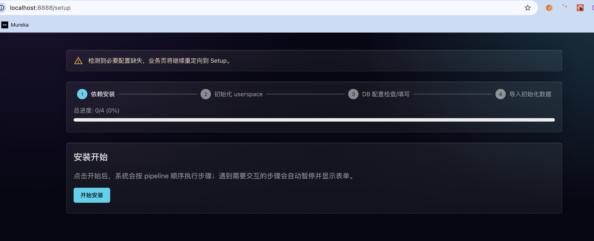
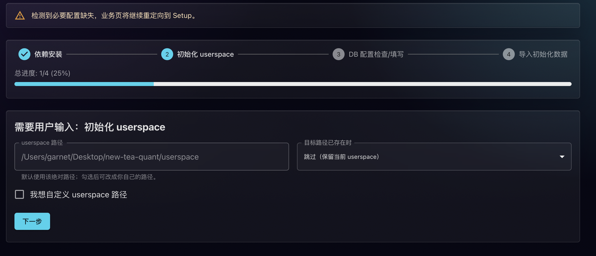
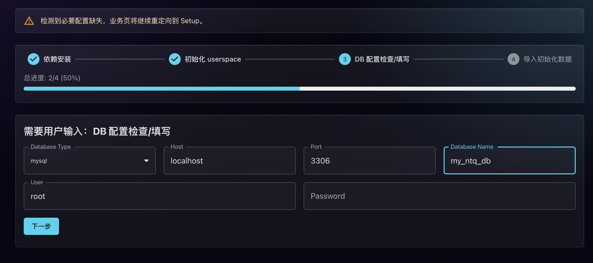
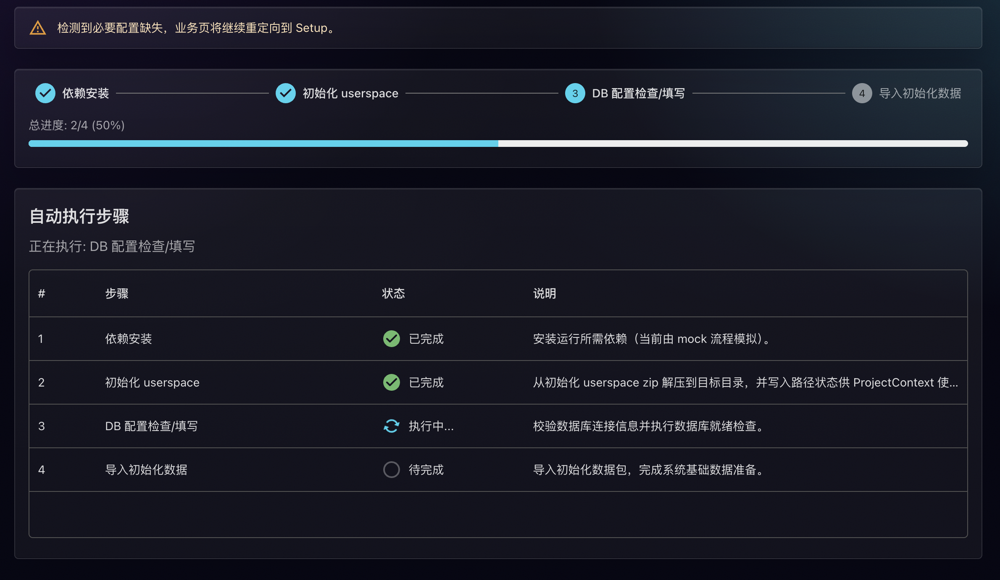
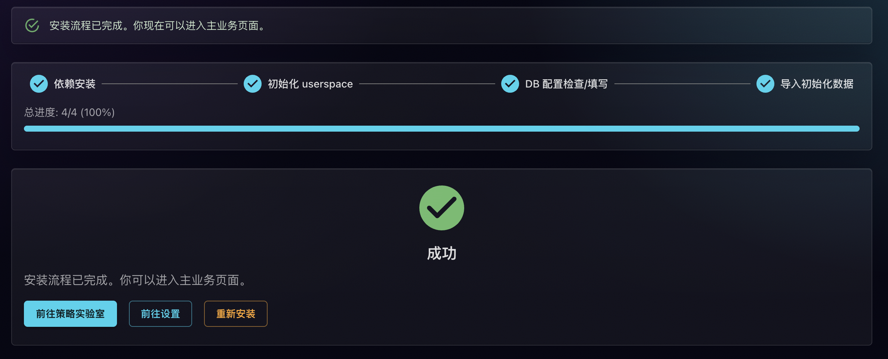

# New Tea Quant (NTQ) - A-Share Quant Research Framework

<br/>

<p align="center">
  
</p>

<p align="center">
  <a href="CHANGELOG.md"></a>&nbsp;
  <a href="#"></a>&nbsp;
  <a href="#"></a>&nbsp;
  <a href="https://github.com/garnet1985/new-tea-quant/actions/workflows/ci.yml"></a>&nbsp;
  <a href="LICENSE"></a>
</p>

> For the **canonical, fully maintained documentation** (Chinese), see **[README.md](README.md)**.

Author: Garnet Xin

<a href="https://github.com/garnet1985/new-tea-quant"></a>&nbsp;
<a href="https://gitee.com/garnet/new-tea-quant"></a>&nbsp;
<a href="https://new-tea.cn"></a>

## Major update

**NTQ now ships with a Web UI**: a React frontend (`core/ui/fed`) and a Python BFF (`core/ui/bff`). After you start them locally, you can use the browser for Strategy Lab, strategy scanning, the graphical setup wizard, app settings, and more.

> **Tip:** This file is a shorter English overview. Screenshots below are from the Chinese UI; labels on your screen may read in Chinese.

### What is NTQ?

**NTQ (New Tea Quant)** is a local, single-machine quantitative research framework for A-share strategies.  
It focuses on helping you **verify trading ideas quickly**, and then **apply the same logic to real-time market data** to enumerate opportunities.

Examples of ideas you can validate:

- "Is weekly RSI < 20 a good entry signal?"
- "Do MACD golden / dead crosses really work on my universe?"
- "What is the win rate of chasing 'hot' stocks under my own rules?"

NTQ provides:

- A **strategy research framework** (multi-process / multi-threaded)
- Detailed **logs and intermediate values** so that every result is traceable and reproducible
- The ability to **plug in your own data source** and **your own notification / trading layer**

> NTQ itself is free and open source (Apache 2.0). Some capabilities (data, notifications, trading) require you to integrate third-party platforms or APIs by yourself.

### Tech stack

- **Language**: Python 3.9+
- **Database**: PostgreSQL or MySQL
- **Runtime for UI**: Node.js (for installing/running the frontend)
- **License**: Apache 2.0

---

## Quick start (about 5 minutes)

**Goal:** bring up the stack and run the built-in **`example`** strategy.

### Prerequisites

- **Python 3.9+**. If you need a step-by-step install guide (Chinese): [install-python](https://new-tea.cn/zh-hans/install-python).
- **MySQL or PostgreSQL**. Install walkthrough (Chinese): [install-database](https://new-tea.cn/zh-hans/install-database).
- **Node.js** (for the Web UI). Download from [nodejs.org](https://nodejs.org/) and run the installer (defaults are usually fine).

### Step 1: Get the code

Either:

- **Git clone** (recommended):

```bash
git clone https://github.com/garnet1985/new-tea-quant.git
cd new-tea-quant
```

- **Download ZIP**: on the GitHub repo page use **Code → Download ZIP**, extract, and open a terminal in the **`new-tea-quant`** root (the folder that contains `launcher.py`).

### Step 2: Start the setup wizard

From the **repository root**, run one of:

```bash
python launcher.py
```

If `python` is not 3.9+, try:

```bash
python3 launcher.py
```

The entry point switches to the repo root, ensures the virtual environment, checks Node/npm, installs Web UI dependencies when needed, then starts **BFF + frontend** and opens the browser to the **Setup** wizard (driven by the BFF setup API).

### Step 3: Complete setup in the browser

Follow the on-page steps (database, userspace path, data import, etc.). The UI may be Chinese-only. Below are **five reference screenshots**; wording on your build may differ slightly.

**Figure 1**



The first screen installs required dependencies (duration depends on your network). Click **「开始安装」** (*Start installation*) and wait.

**Figure 2**



Configure the **userspace** root directory:

- Use the **default path** shown by the wizard (click **「下一步」** — *Next*).
- Or tick **「我想自定义 userspace 路径」** (*I want a custom userspace path*) and enter another directory on your machine (ensure free disk space; if the folder already exists, the wizard will ask how to handle conflicts).

**Figure 3**



Connect **MySQL** or **PostgreSQL**. Have the server running, then fill in:

- **Database type** (`mysql` / `postgresql`).
- **Host** and **port** (defaults are usually local; use your cloud/remote values if applicable).
- **User** and **password** (must allow connections and **creating databases**; if the database does not exist yet, the wizard will try to create it).
- **Database name**: prefer a **new or dedicated empty database**. If you point to an existing database, initialization will write/alter schemas — **do not use a production database** that holds important data.

After the connection check passes, click **「下一步」** to continue. You can change database settings later under **「设置」** (*Settings*).

**Figure 4**



After the database step, the pipeline continues with **data import** and other steps; the page shows progress. This phase can take a while — keep the tab open and wait until it finishes.

**Figure 5**



When all steps succeed, click **「前往策略实验室」** (*Go to Strategy Lab*) to enter the main UI.

### Run the `example` strategy from the CLI

From the repository root:

```bash
python start-cli.py -sp
```

If you see output in the terminal, the first strategy run succeeded.

> **Note:** If you downloaded the **larger demo ZIP** from the official site, put it under `setup/init_data/` as described in **Data** below, then run **`python install.py`** to import it. For the small bundled dataset only, finishing the wizard + the command above is enough.

### More common commands

```bash
python start-cli.py -h      # show help
python start-cli.py -sa     # simulate with capital
python start-cli.py -t      # generate labels / features
```

The default CLI entry is **`start-cli.py`**. If older docs mention `start.py`, treat **`start-cli.py`** as the source of truth.

You can edit files under `userspace/strategies/` (for example `settings.py` or workers) to customize algorithms and goals.

---

## Data

- The repo ships with a **small demo dataset** for a fast first run.
- For a **larger (3-year) demo dataset**, register on **[new-tea.cn](https://new-tea.cn)**, download the ZIP, place it under **`setup/init_data/`** (only one ZIP in that folder; clear the folder first if needed), then run **`python install.py`**.
- You can also **connect your own data source** (for example Tushare); see **`userspace/data_source/README.md`**.

---

## Documentation & website

- Official site (Chinese, richer docs and examples): **[new-tea.cn](https://new-tea.cn)**
- Canonical project README (Chinese): **[README.md](README.md)**

---

## Testing

```bash
python -m pytest
```

Please ensure tests pass before submitting a PR.

---

## License & disclaimer

This project is licensed under **Apache License 2.0** (see `LICENSE`).  
**Disclaimer**: for learning and research only, not investment advice; backtest results do not guarantee future performance.
