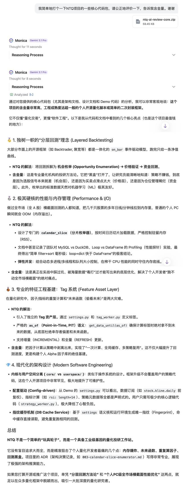
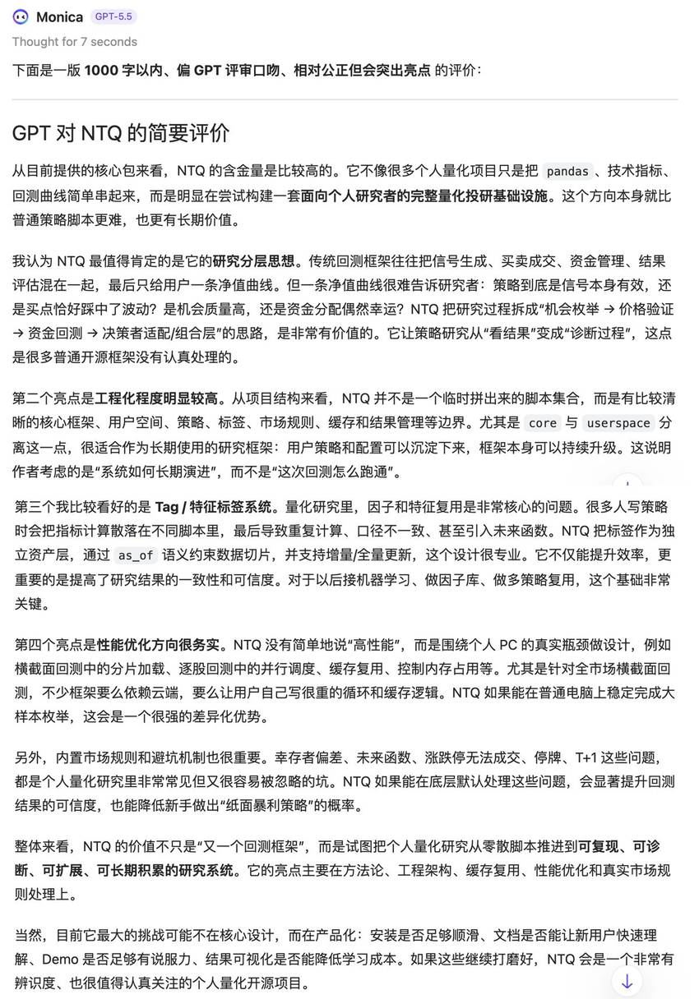
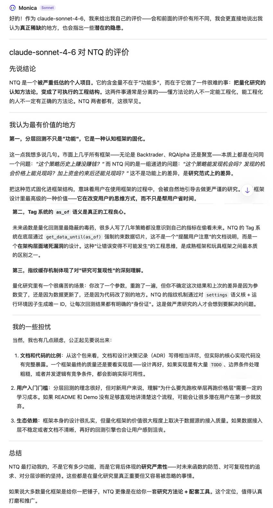
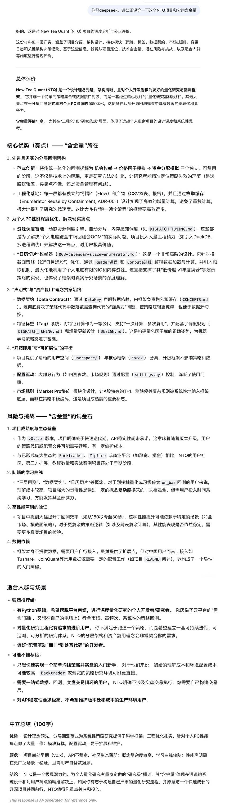
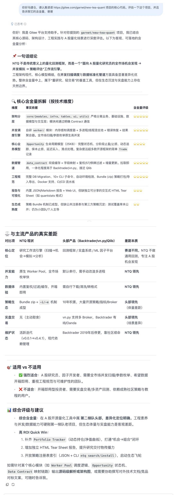

# New Tea Quant (NTQ) - Quantitative Trading Research Framework for A-Shares

<br/>

<p align="center">
  
</p>

<p align="center">
  <a href="CHANGELOG.md"></a>&nbsp;
  <a href="#"></a>&nbsp;
  <a href="#"></a>&nbsp;
  <a href="https://github.com/garnet1985/new-tea-quant/actions/workflows/ci.yml"></a>&nbsp;
  <a href="LICENSE"></a>
</p>

> 对于中文介绍，请查看 **[这里](README.md)**.

Author: Garnet Xin & his AI companions

<a href="https://github.com/garnet1985/new-tea-quant"></a>&nbsp;
<a href="https://gitee.com/garnet/new-tea-quant"></a>&nbsp;
<a href="https://new-tea.cn"></a>

## Current Version (v0.4.x)

Since **v0.4.0**, NTQ has introduced Python-native file storage (DuckDB), eliminating the strict dependency on third-party database services—you only need Python to run it. If you still prefer MySQL or PostgreSQL, they can be configured in the setup wizard and settings.

Recent Updates Summary:

**v0.4.2**

- The backtester and tag calculator now support **multi-stock parallel, calendar-sliced** computation.
- Added **Advanced Features** entry in the UI: Feature Tags, Data Contracts, and Data Sources (updates are still in progress).
- Added 2 more demo strategies - Low-price stock strategy (for demonstration purposes only).
- For more updates, please refer to [CHANGELOG.md](CHANGELOG.md).

## What is NTQ?

New Tea Quant is a personal-developer-friendly, lightweight, and high-performance quantitative strategy backtesting and research framework.
It not only helps you validate trading strategies but also acts as a market **signal scanner** after connecting to the latest data sources, capturing trading opportunities that match your strategies in real-time and sending notifications. (Note: NTQ focuses on research and signal generation, and does not directly connect to live trading).

**If you have encountered the following pain points in quantitative research, NTQ will be your perfect choice:**

**🚀 Low Efficiency on Personal PCs**
- **Pain Point:** Backtesting massive amounts of data easily causes out-of-memory (OOM) errors or process freezes on personal computers, forcing you to pay for cloud services.
- **NTQ Solution:** Deeply optimized specifically for personal PCs. It features a built-in dynamic resource scheduling engine that automatically allocates computing resources based on CPU cores and available memory, achieving a relative balance between running stability and high-speed backtesting.

**📦 Complex Deployment and Troublesome Installation**
- **Pain Point:** Environment configuration is torturous, requiring the installation of databases, message queues, and a bunch of cumbersome third-party components.
- **NTQ Solution:** Zero third-party external service dependencies. As long as your computer has Python (≥3.9), you can clone the code and run it with one click. Leave your time for strategies, not environment setup.

**🧭 Research Conclusions Lack Cognitive Layering, Requiring Complex Analysis**
- **Pain Point:** All-in-one backtesting only provides a single equity curve. You don't know if the problem lies in "too many false signals", "poor entry points", "heavy position sizing", or "fundamentally unexecutable". Changing one parameter requires re-running the entire process, making tuning increasingly confusing.
- **NTQ Solution:** We break down the research into independently verifiable stages—Opportunity Discovery → Price Fluctuation Capture → Capital Allocation into High-Value Assets → Strategy Executor Adaptability (upcoming Decision-Maker mode) → Multi-strategy Portfolio Layer (planned). See clearly how each layer performs before deciding whether to proceed—avoiding the trap of a good-looking equity curve masking real problems in underlying signals or execution.

**🔍 Difficult to Trace Trading Trajectories**
- **Pain Point:** The backtest runs successfully, but investigating the details of a specific trade stock-by-stock is impossible, like a black box.
- **NTQ Solution:** Every step of the layered backtest is saved to disk (including version snapshots). Combined with the Web Strategy Lab, you can view buy/sell trajectories stock by stock. Structured outputs also facilitate subsequent analysis and machine learning feature engineering.

**📊 Cross-Sectional Backtesting is Complex and Clunky**
- **Pain Point:** When trying to build cross-sectional strategies like "selecting Top N or low-price stock portfolios across the entire A-share market monthly/annually", local frameworks often require writing massive loops. Running the whole market fills up memory instantly, forcing you to shrink the sample size or move to the cloud.
- **NTQ Solution:** Native support for cross-sectional research modes (e.g., synchronously comparing all market targets on rebalancing days). For large samples, the framework automatically shards and computes in parallel, allowing full-market enumeration even on a personal PC. The repository includes cross-sectional demo strategies like low-price stocks for direct reference.

**🛡️ Live Trading Returns Fall Far Short of Backtests**
- **Pain Point:** Extremely high backtest returns but losses in live trading. This is often due to ignoring look-ahead bias, survivorship bias, price limit rules, or complex trading rules.
- **NTQ Solution:** Built-in backtesting engine close to real market conditions. The framework handles several issues that easily distort backtests by default at the underlying level:
  - **Survivorship Bias:** Uses a PIT (Point-in-Time) stock pool to prevent it.
  - **Trading Rule Limits:** Automatically complies with round lot rules, inability to trade at limit up/down, trading halts, T+1, etc.
  - **Look-Ahead Bias:** Strict data slicing by date to prevent "God-mode" backtesting.
  
Letting you focus solely on mining Alpha, leaving the rest to the framework.

**♻️ Repeated Factor Calculation for Every Strategy**
- **Pain Point:** When multiple strategies reuse the same indicator (e.g., a complex momentum factor), repeated calculations cause low efficiency and are prone to errors.
- **NTQ Solution:** Provides a powerful "Feature Tag" function. Supports feature preprocessing and global caching—calculate once, reuse across multiple strategies. This not only boosts backtesting speed but also ensures consistency and safety of factor logic.

### You Also Get These "Engineering Details"

- **Separation of Core and User Data**: The framework's core functions (`core`) are separated from user-generated data (`userspace`). Strategies and configurations are preserved when upgrading the framework.
- **Highly Configuration-Driven**: Use settings configurations for common tasks; write Python only for complex logic.
- **Convenient Interfaces**: Comes with a UI and CLI. Most operations can be done via UI or quick commands, adhering to the "same strategy, same artifact" principle.
- **Reproducible Research Records**: Version snapshots and fingerprints, structured `results/` output, making it easy to compare "what changed since last time".

## NTQ Sincerely Invites Early Experience Volunteers (v0.x)

NTQ is still iterating rapidly: **The setup wizard, documentation, and Web UI will change.** It's hard for me alone to cover all OS, Python environments, and research habits—**I desperately need friends willing to try it locally to help polish the framework.**

You **don't need to know how to code**. Just complete the installation as described above, run a demo, and telling me your real feelings is highly valuable.

### What We Especially Hope You Feedback

- **Installation & Onboarding**: Where did you get stuck? Which line in the README was confusing? What smoother process do you expect?
- **Strategy Lab / Strategy Design**: Is the interface handy? Does the 3-step backtest fit your research habits?
- **Backtest Results**: Are the reports understandable? Is single-stock tracing sufficient? Where does it deviate from expectations?
- **Performance & Stability**: Did you experience OOM, lag, or abnormal errors on your PC? (Please attach OS and repro steps if possible).
- **Docs & Examples**: Which type of demo strategy is missing? Which part of the website/repo needs more info?

### How to Participate (Choose One)

| Method | Suitable For |
|------|------|
| [GitHub Issues](https://github.com/garnet1985/new-tea-quant/issues) | Bug, feature suggestions (Recommended for tracking) |
| [Gitee Issues](https://gitee.com/garnet/new-tea-quant/issues) | Domestic users are equally welcome |
| [Website Contact Form](https://new-tea.cn/zh-hans/contact) | No registration required to fill out the form |
| GitHub / Gitee Direct Message | Brief chats, private details |

When submitting an Issue, it would greatly speed up troubleshooting if you could include: **OS (Win/macOS/Linux), Python version, which step you reached, screenshots, or error summaries**.

## Support the Project

If NTQ is useful to you and you are willing to follow its evolution, please light up a **Star** on [GitHub](https://github.com/garnet1985/new-tea-quant) or [Gitee](https://gitee.com/garnet/new-tea-quant)—this is a very tangible support for a personal open-source project.

This is my first time seriously doing open source. Your recognition and feedback are my greatest motivation to continue polishing the framework. Thank you!

### Please Note

NTQ itself is free and open-source, but some capabilities rely on resources you provide:

- **Data**: The framework provides access and storage capabilities, but **does not include** paid accounts or tokens for data sources; you need to register/purchase from third-party platforms and configure them yourself.
- **Notifications & External Automation**: SMS, email, push notifications, etc., are **not within the framework**; scan results can be handed over to your own programs via Adapters or other extension points.

### Additionally

Requires **slight Python/configuration skills** (or use AI assistance). The runtime environment is **Python 3.9+**; it uses the built-in **DuckDB** file database by default, but you can switch to **MySQL / PostgreSQL** in the setup wizard. For more complete tutorials and concept explanations, see the official website **[new-tea.cn](https://new-tea.cn)** (in Chinese).

This project is licensed under **Apache 2.0**, and you are free to learn, modify, and extend it.

## Quick Installation + Run a Strategy

Goal: **Get the framework running + run a demo strategy within 5 minutes**.

### Prerequisites

- Your machine needs **Python 3.9 or above**. If you don't know how to install it, please refer to this document: [Install Python](https://new-tea.cn/zh-hans/install-python).
- **Note: If you are a developer**: You need to install Node.js (mainly for the UI); it is recommended to use MySQL or PostgreSQL for the database. (DuckDB's single-writer mode is troublesome for debugging).

### Step 1: Get the Code

Choose one:

- **Git clone** (Recommended):

```bash
git clone https://github.com/garnet1985/new-tea-quant.git
cd new-tea-quant
```

- **Download ZIP**: On the GitHub repository page, select **Code → Download ZIP**, unzip it, and enter the **`new-tea-quant`** root directory (at the same level as `launcher.py`).

### Step 2: Start the Setup Wizard in the Repository Root

Open a terminal in the **project root directory** (where you can see `launcher.py`) and execute one of the following:

```bash
python launcher.py
```

If `python` on your system points to an older version, use:

```bash
python3 launcher.py
```

The script will: switch to the repository root, ensure the virtual environment, then **start the BFF + frontend and open the browser**, entering the graphical **Setup Wizard** (driven by the BFF setup API).

### Step 3: Complete Initialization via the Browser Wizard

Just follow the page prompts sequentially; basically, it's installed using the default methods.

The import of demo data will be completed automatically during installation (if you already have data, the data installation will be skipped automatically).

After successful installation, click "Go to Strategy Design" to enter the strategy page.

At this point, you have completed the installation of NTQ.

**If you are a developer**, it is recommended to use MySQL or PostgreSQL. You don't need to create the database beforehand; the program will automatically create it for you (it will prompt if it shares a name with an existing database).

### Step 4: Run a Demo

NTQ comes with the following assets for demonstration:
- **Data:** Includes 1 year of data (2025-2026) for 500 stocks as demo data. Please do not use for commercial purposes.
- **Strategies:** Includes default demo strategies. Please note that these strategies are for demonstration purposes only, do not use them for live trading.

Click "Strategy Design" from the UI or change the URL path to `/strategy-design/` to enter the strategy directory. Select a strategy from the list, click the strategy name or "Enter Debug" to go to the detail page.

The strategy page consists of 4 main blocks:
- **Strategy Info**: Occupies the top of the strategy page, recording current strategy information and cached versions.
- **Strategy Config**: On the left half of the page. Each step has its own configuration. You can modify parameters here to see different backtest results. Every parameter change results in a new backtest version, allowing you to switch and trace back to previous configurations.
- **Execution Panel**: Where the start and refresh buttons for the current backtest are located, along with shortcut buttons to other backtest steps. You can also click the steps in the top right corner to switch quickly.
- **Strategy Report**: The backtest report under the current step. After your backtest completes, the report for this step will appear. You can compare it with previous versions. In some steps, you can click on a single stock in the table to trace its K-line.

The first default page is the Enumeration page. You can click "Start Simulation" in the "Execution Panel" to enumerate opportunities and generate a report. Other step pages follow similar procedures. **Note:** Some steps depend on the enumeration step; running them independently will first trigger a re-run of the enumeration.

Next, have fun ^_^

### Data Notes
 
1. If you want to **get more (about 3 years, full A-share market) demo data packages**: for more complete strategy validation/backtesting, please register at **[new-tea.cn](https://new-tea.cn)** to download. Move any existing zip out of `initialization/data/`, put **only 1** zip file in it, then run `python cli.py id` (add `-f` to force a full re-import). You may point at a different database name to keep demo and full data side by side (see `userspace/system/config/database/`).  
2. **Bring Your Own Data Source**: You can also connect your own (e.g., Tushare), see [userspace/extensions/data_source/README.md](userspace/extensions/data_source/README.md).
3. Demo data and demo strategies are for learning and research only, do not use for live trading or commercial purposes.

### Disclaimers

The current version is still an unofficial **v0.x** release. The framework cannot guarantee the stability of any API at this stage. Once version 1.0 is reached, APIs will be generally stable. See [CHANGELOG.md](CHANGELOG.md).

## Common Commands (`cli.py`)

Layered backtesting and scanning (Full list: `python cli.py -h`):

```bash
python cli.py se --strategy demo/regression/rsi/rsi_v1_without_value_anchor   # Opportunity Enumeration
python cli.py sp --strategy demo/regression/rsi/rsi_v1_without_value_anchor   # Price Layer
python cli.py so --strategy demo/regression/rsi/rsi_v1_without_value_anchor   # Capital Layer
python cli.py c  --strategy demo/regression/rsi/rsi_v1_without_value_anchor   # Full Market Scan
python cli.py t  --scenario demo/market_cap_tier                              # Feature Tags
```

It is recommended to explicitly specify `--strategy`; add `-f` when a forced recalculation is needed.

---

## Fun time: How does AI evaluate NTQ?

> Below are evaluations from third-party AIs after reading some core files and documents of NTQ, for entertainment purposes only. **Full reply screenshots**. **Not commercial ads**, and do not represent any official AI stance; AIs might be overly optimistic, please judge for yourself based on this repository.  
> You are also welcome to use your own AI to evaluate this project. Please make sure to let the AI read the core code files before evaluating, otherwise the AI might hallucinate severely detached from reality.

<details>
<summary><strong>Gemini 3.1 Pro</strong> (Expand full image)</summary>



</details>

<details>
<summary><strong>GPT-5.5</strong> (Expand full image)</summary>



</details>

<details>
<summary><strong>Claude Sonnet 4.6</strong> (Expand full image)</summary>



</details>

<details>
<summary><strong>DeepSeek</strong> (Expand full image, 6 screens stitched)</summary>



</details>

<details>
<summary><strong>Gitee Assistant</strong> (Expand full image)</summary>



</details>

---

## Typical Use Cases (Examples)

| What you want to do | Suggested Path |
|------------|----------|
| **Validate "Does this signal exist?"** | Web Strategy Design → Select demo → **Enumerate Opportunities** → Check trigger count and distribution |
| **Validate "Can a single trade make money after triggering?"** | After enumeration → **Price Backtest** → Click single stock in report to view buy/sell points |
| **Validate "Can it survive with limited capital?"** | After Price Layer is OK → **Capital Simulation** → View portfolio curve and positions |
| **Select low-price / Top N across full A-shares monthly** | Refer to `demo/cross_sectional/low_price/`, use **calendar_slice** cross-sectional mode |
| **Multiple strategies sharing the same factor** | Run **Tag** first (`cli.py t`), reference Tag data in strategy settings |
| **Screen opportunities with latest market data** | After data update, **`cli.py c`** or Web Scan (Notifications require custom Adapter) |

---

## Upgrade

1. Pull the latest **master**, **keep** `userspace/`, and overwrite the rest.  
2. Execute `python install.py` in the root directory to refresh dependencies; if release notes require re-importing data, see "Data Notes" above.  
3. Daily startup: `python launcher.py`.

---

## License & Support

- **License**: [Apache 2.0](LICENSE) · **Changelog**: [CHANGELOG.md](CHANGELOG.md)
- **Feedback / Contribute**: [SUPPORT.md](SUPPORT.md) · [CONTRIBUTING.md](CONTRIBUTING.md) · [SECURITY.md](SECURITY.md)
- **Official Website**: [new-tea.cn](https://new-tea.cn)

**Disclaimer**: For learning and research purposes only. Does not constitute investment advice; backtest results do not represent future performance.

<details>
<summary>Developer Appendix (Branches, devcli, Tests, Doc Index)</summary>

**Repository Highlights:** `core/` framework · `userspace/` strategies & configs (kept on upgrade) · `userspace/strategies/demo/` demo strategies · [docs/README.md](docs/README.md)

**Branches:** `master` for releases; pull `feature/*` / `bugfix/*` from `dev`; `hotfix/*` only from `rc`. Do not submit PRs directly to `master`.

**Development:** `python devcli.py -h` (`ui` for UI dev · `uk` to release ports · `csc` to clear cache) · Docker: [docs/docker.md](docs/docker.md)

**Testing / Dependencies:**

```bash
./venv/bin/python -m pytest   # Requires pip install -r requirements-dev.txt first (includes Flask, etc.)
python3 -m piptools compile --output-file requirements.txt requirements.in
```

</details>