# New Tea Quant (NTQ) - Quantitative Trading Research Framework for A-Shares

<br/>

<p align="center">
  
</p>

<p align="center">
  <a href="CHANGELOG.md"></a>&nbsp;
  <a href="#"></a>&nbsp;
  <a href="#"></a>&nbsp;
  <a href="https://github.com/garnet1985/new-tea-quant/actions/workflows/ci.yml"></a>&nbsp;
  <a href="LICENSE"></a>
</p>

> For the Chinese introduction, see **[here](README.md)**.

Author: Garnet Xin & his AI companions

<a href="https://github.com/garnet1985/new-tea-quant"></a>&nbsp;
<a href="https://gitee.com/garnet/new-tea-quant"></a>&nbsp;
<a href="https://new-tea.cn"></a>

## Current Version (v0.4.x)

Since **v0.4.0**, NTQ ships Python-native file storage (DuckDB) and no longer requires a third-party database service—Python alone is enough to run. If you still prefer MySQL or PostgreSQL, both can be configured in the setup wizard and settings.

Recent updates summary:

**v0.4.4**

- Portfolio backtests use a dual-track approach: **adjusted (continuous) prices** for signals and **raw prices** for fills, improving portfolio realism.
- New portfolio hook to choose among multiple concurrent opportunities, for stronger intervention during simulation.
- UI **Advanced Features** entry: Feature Tags, Data Contracts, and Data Sources.
- Module standardization: unified API docs, usage guides, architecture notes, and more.
- See [CHANGELOG.md](CHANGELOG.md) for the full list.

## What is NTQ?

New Tea Quant is a personal-developer-friendly, lightweight, high-performance framework for quantitative strategy backtesting and research.
It helps you validate trading strategies and, once connected to up-to-date data, acts as a market **signal scanner** that can capture matching opportunities and send notifications. (Note: NTQ focuses on research and signal generation; it does not connect to live brokerage trading.)

**If you have hit these pain points in quant research, NTQ may be a strong fit:**

**🚀 Low efficiency on personal PCs**
- **Pain point:** Large backtests often OOM or freeze on a laptop, pushing you to pay for cloud.
- **NTQ approach:** Tuned for personal machines. A built-in dynamic resource scheduler allocates work from CPU cores and free memory, balancing stability and speed.

**📦 Painful deployment**
- **Pain point:** Databases, queues, and many third-party services just to get started.
- **NTQ approach:** No required external services. With Python ≥ 3.9, clone and run—spend time on strategies, not environment setup.

**🧭 Flat “one equity curve” research**
- **Pain point:** A single NAV curve does not tell you whether the issue is noisy signals, bad entries, oversized positions, or unexecutable rules; every parameter tweak re-runs everything.
- **NTQ approach:** Split research into independently checkable layers—opportunity discovery → price-capture ability → capital allocation into high-value names → executor fit (upcoming decision-maker mode) → multi-strategy portfolio (planned). Judge each layer before going deeper, instead of letting one pretty curve hide signal or execution problems.

**🔍 Hard-to-trace trades**
- **Pain point:** The backtest “works,” but you cannot drill into a single stock’s path.
- **NTQ approach:** Each layered step is persisted (including version snapshots). The Web strategy workbench shows buy/sell paths per stock. Structured outputs also help downstream analysis and ML feature work.

**📊 Clunky cross-sectional backtests**
- **Pain point:** Monthly/annual Top-N or low-price baskets across all A-shares usually need huge loops and fill memory.
- **NTQ approach:** Native cross-sectional modes (e.g. compare the full universe on rebalance days). Large samples are sharded and parallelized so full-market enumeration can run on a PC. Demo strategies such as low-price cross-section live in the repo.

**🛡️ Live returns far below backtests**
- **Pain point:** Sky-high backtests, live losses—often from look-ahead bias, survivorship bias, limit-up/down rules, or other market constraints.
- **NTQ approach:** A market-aware engine that defaults to handling common distortion sources:
  - **Survivorship bias:** PIT (point-in-time) universes
  - **Trading rules:** lot sizes, untradeable limit moves, T+1, and similar
  - **Look-ahead bias:** strict date cuts so you do not get “god mode”  
  Focus on Alpha; leave the plumbing to the framework.

**♻️ Recomputing the same factors per strategy**
- **Pain point:** Shared indicators (e.g. complex momentum) are recomputed everywhere and easy to get wrong.
- **NTQ approach:** Feature Tags with preprocessing and global cache—compute once, reuse across strategies for speed and consistency.

### Engineering details you also get

- **Core vs user data:** `core` stays separate from `userspace`; upgrades keep strategies and configs.
- **Config-first:** settings cover common work; write Python when logic gets complex.
- **UI + CLI:** most tasks via Web or short commands, with “same strategy → same artifacts.”
- **Reproducible records:** version snapshots, fingerprints, and structured `results/` for “what changed vs last run.”

## NTQ sincerely invites early volunteers (v0.x)

NTQ is still moving fast: **the wizard, docs, and Web UI will change.** One person cannot cover every OS, Python setup, and research habit—**local testers are hugely valuable.**

You **do not need to code**. Install, run a demo, and share honest feedback.

### What we especially want to hear

- **Install & onboarding:** where you stuck, unclear README lines, smoother flows you expect
- **Strategy lab / design:** UI feel, whether the three-step backtest matches how you research
- **Reports:** readability, single-stock tracing, mismatches vs expectation
- **Perf & stability:** OOM, lag, crashes (OS + repro steps help a lot)
- **Docs & examples:** missing demos, gaps on the site/repo

### How to participate (pick one)

| Channel | Best for |
|------|------|
| [GitHub Issues](https://github.com/garnet1985/new-tea-quant/issues) | Bugs & features (preferred for tracking) |
| [Gitee Issues](https://gitee.com/garnet/new-tea-quant/issues) | Users preferring Gitee |
| [Website contact](https://new-tea.cn/zh-hans/contact) | Form without registering |
| GitHub / Gitee DM | Short or private notes |

Please include **OS (Win / macOS / Linux), Python version, which step, screenshot or error summary** when you can.

### Please note

NTQ is free and open source, but some capabilities need your own resources:

- **Data:** the framework stores and connects; it does **not** include paid data tokens—register those yourself.
- **Notifications:** SMS/email/push are **out of scope**; route scan results through Adapters or your own tools.

### Also

Expect **light Python/config skill** (or AI help). Runtime is **Python 3.9+**; default store is **DuckDB**, with **MySQL / PostgreSQL** optional in the wizard. Fuller tutorials (Chinese) live at **[new-tea.cn](https://new-tea.cn)**.

Licensed under **Apache 2.0**—learn, modify, and extend freely.


## Quick install + run a strategy

Goal: **framework up + one demo strategy in about 5 minutes**.

### Prerequisites

- **Python 3.9+**. If needed: [Install Python](https://new-tea.cn/zh-hans/install-python).
- **Developers:** install **Node.js** (for UI work); prefer MySQL or PostgreSQL (DuckDB’s single-writer mode is awkward while debugging).

### Step 1: Get the code

Either:

- **Git clone** (recommended):

```bash
git clone https://github.com/garnet1985/new-tea-quant.git
cd new-tea-quant
```

- **Download ZIP:** GitHub → **Code → Download ZIP**, unzip, enter the **`new-tea-quant`** root (same folder as `launcher.py`).

### Step 2: Start the setup wizard from the repo root

In the **project root** (where `launcher.py` is):

```bash
python launcher.py
```

On Windows PowerShell you may need:

```bash
python .\launcher.py
```

If `python` is an old version:

```bash
python3 launcher.py
```

The script switches to the repo root, ensures the venv, then **starts BFF + frontend and opens the browser** into the graphical **Setup wizard** (BFF setup API).

### Step 3: Finish initialization in the browser

Follow the prompts; defaults are usually enough.

Demo data import runs during install (skipped if data is already present).

After success, click **Go to Strategy Design**.

That completes NTQ installation.

**Developers:** prefer MySQL/PostgreSQL; you need not pre-create the DB—the app can create it (and will warn on name clashes).

### Step 4: Run a demo

Bundled demo assets:

- **Data:** about **2023-01 ~ 2025-12**, **300** stocks (three years). Not for commercial use.
- **Strategies:** default demos only—do not trade live off them.

#### Open the strategy UI

In the UI click **Strategy Design**, or open `/strategy-design/`:

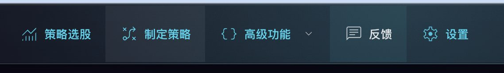

Pick a strategy, then open it via the title or **Enter Debug**:

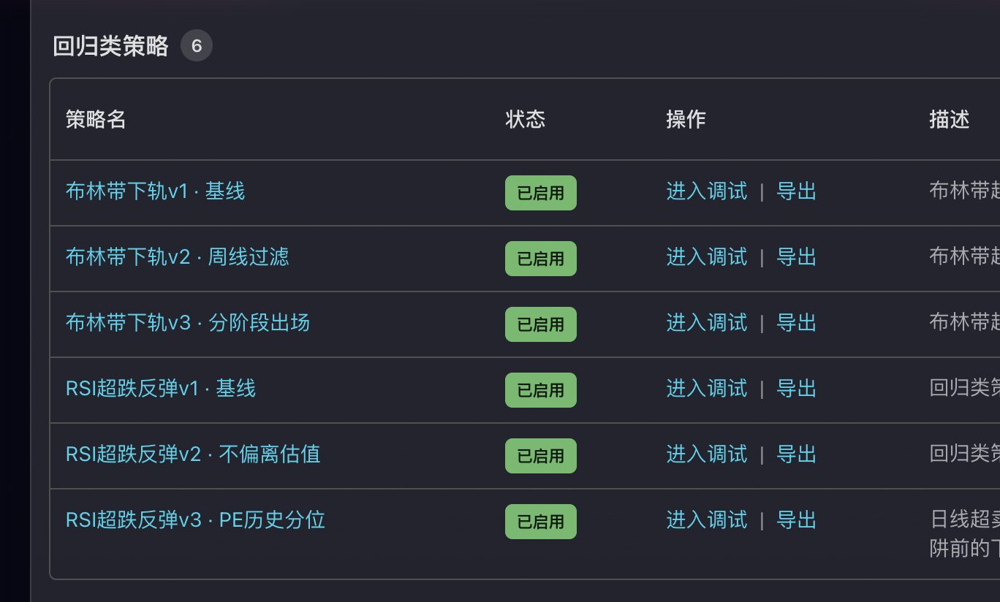

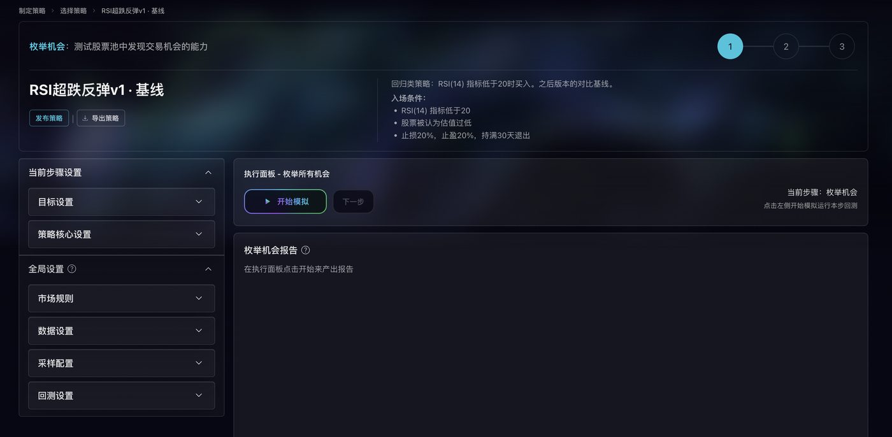

The page has four main areas:

- **Strategy info:** top full-width block—name, description, version, publish and other global actions.
- **Strategy settings:** left panel; changes with each backtest step. Editing parameters creates a new version for comparison.  
  **Note:** Strategy **logic** cannot be edited in the UI—only in `userspace/strategies/`. The UI only tunes parameters exposed in code. (AI-assisted editing may come later.)
- **Execution panel:** run the current step. Three stages:  
  - **Enumerate:** find historical opportunities;  
  - **Price backtest:** 1-share, ignore costs—price-capture quality;  
  - **Portfolio:** starting capital, sizing, risk controls—closer to real trading.
- **Reports:** auto-generated per step after each run.

#### Stage 1: Opportunity enumeration

After enumeration, reports usually split into **per-stock** and **global** (later stages follow the same idea):

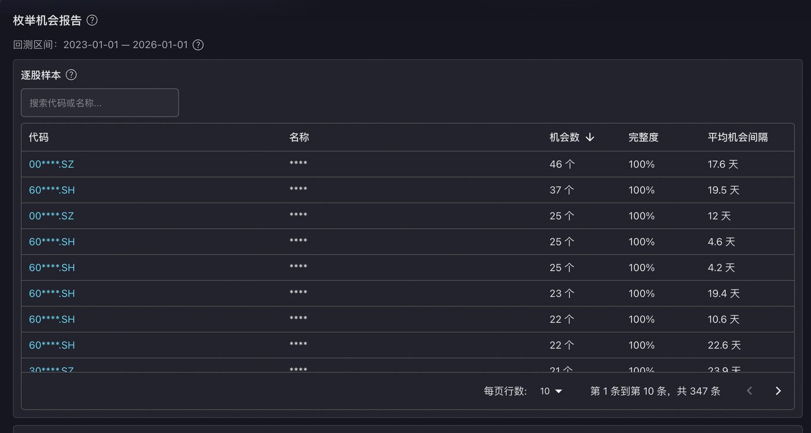

Click a row to open that stock’s chart—K-lines, indicators, and opportunity markers (e.g. blue dots):

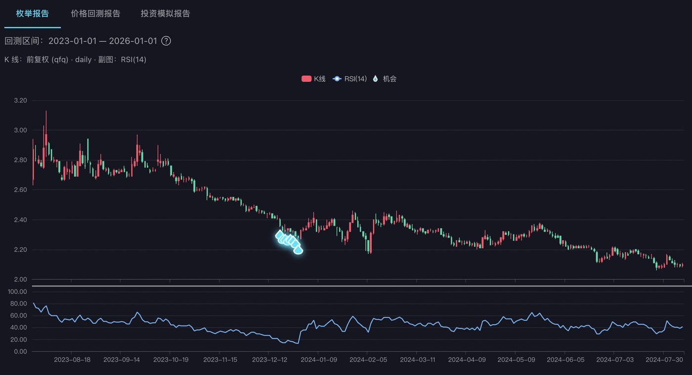

Below the list, the global enum report summarizes where opportunities cluster, average duration, and similar diagnostics:

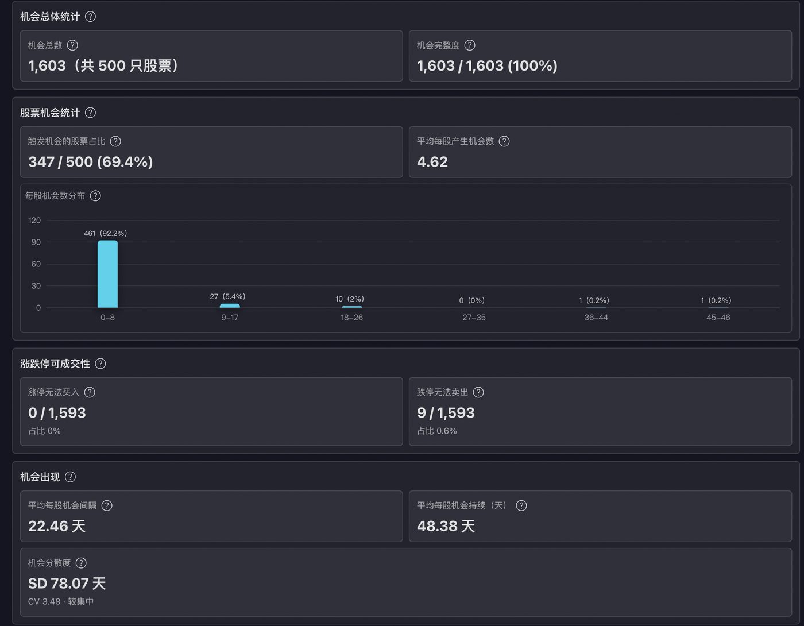

#### Stage 2: Price backtest

Focuses on price-capture quality. The single-stock view shows entries/exits—not P&amp;L drama, but clear timing for debugging:

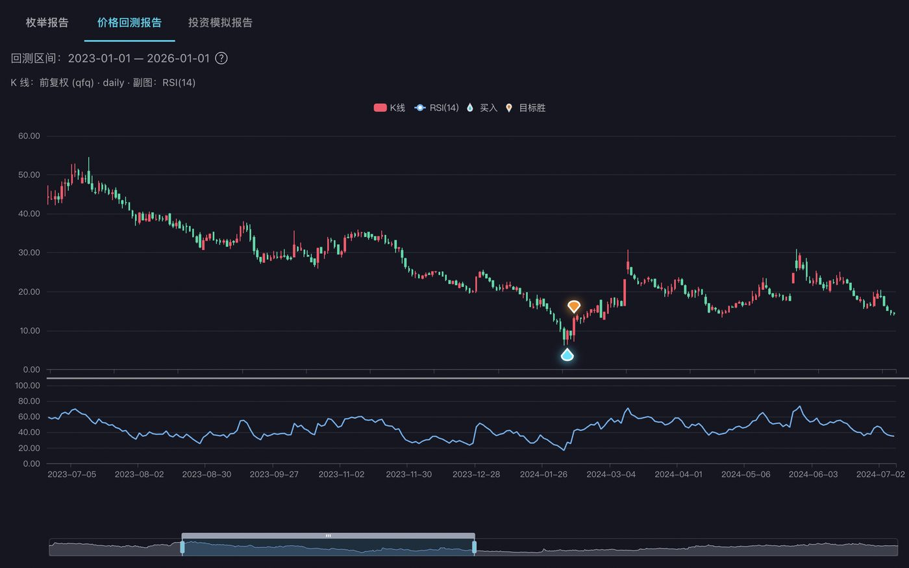

The global report covers buy/sell price distributions, returns, and more—always read it against your configured goals:

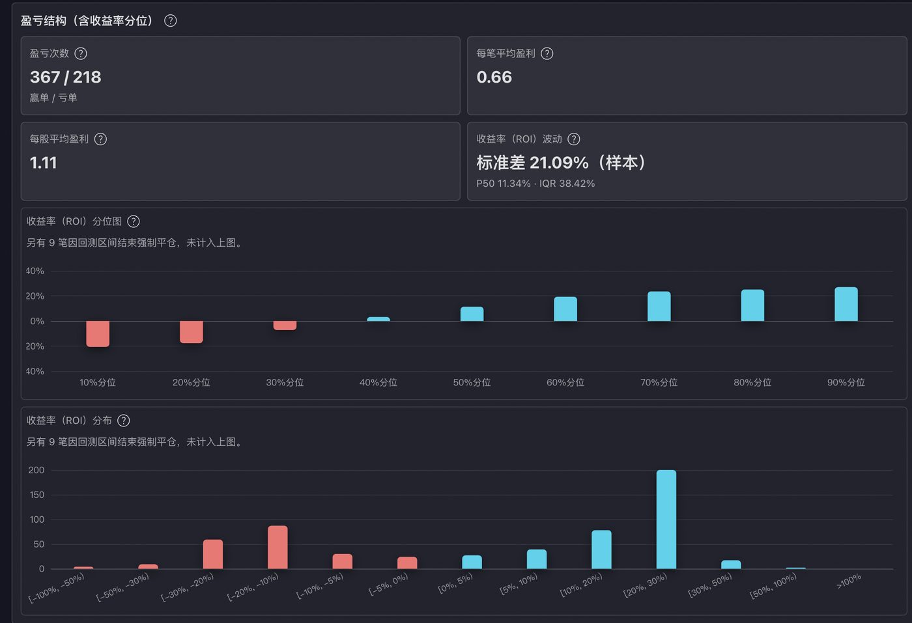

#### Stage 3: Portfolio simulation

Closer to real trading: capital, positions, risk settings, and a historical simulation of whether the strategy can actually make money.  
(Per-stock drill-down from portfolio results is not supported yet.)

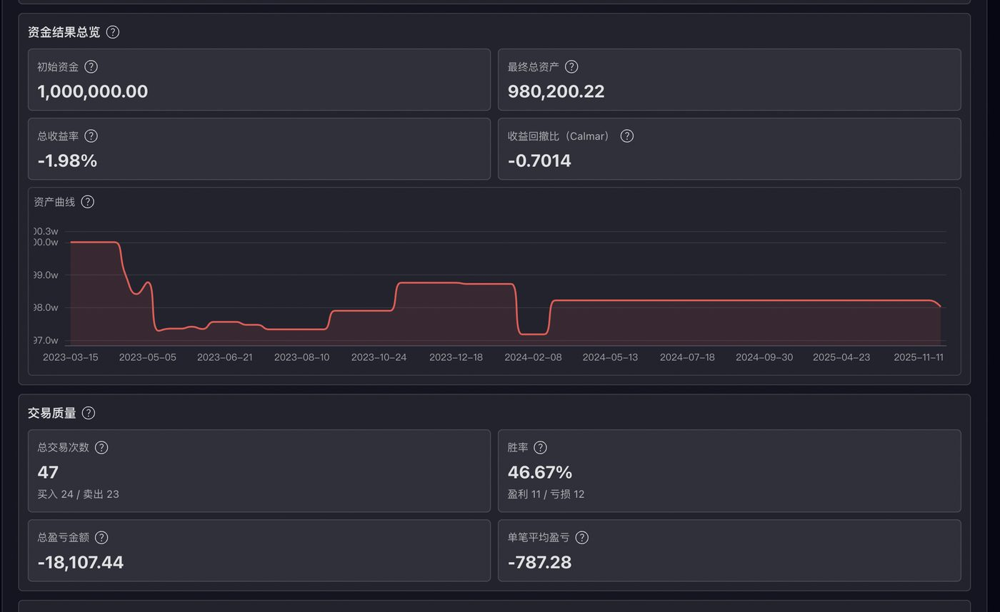

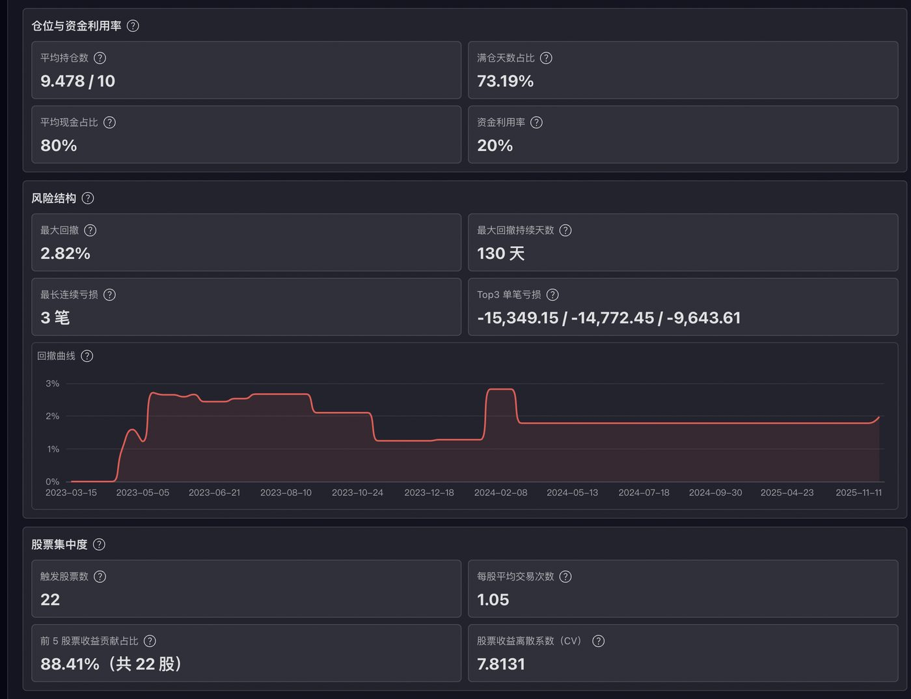

#### Strategy scan: finding live-market opportunities

When a strategy is tuned, use **Strategy Scan** from the main nav to screen current opportunities.

**Important:** click **Publish strategy** under the title on the strategy page first. Otherwise parameters stay in workbench cache and are **not** written back into strategy code—scans will not use your latest debug settings.

For a “real” market scan you typically need:

- **Fresh enough data** (NTQ does not ship a market data vendor; connect your own)
- A **published, complete** strategy

On the scan page you can use **strict mode** (refuse to run if data is stale), pick a strategy, and click **Start scan**. Results list current opportunities your strategy finds:

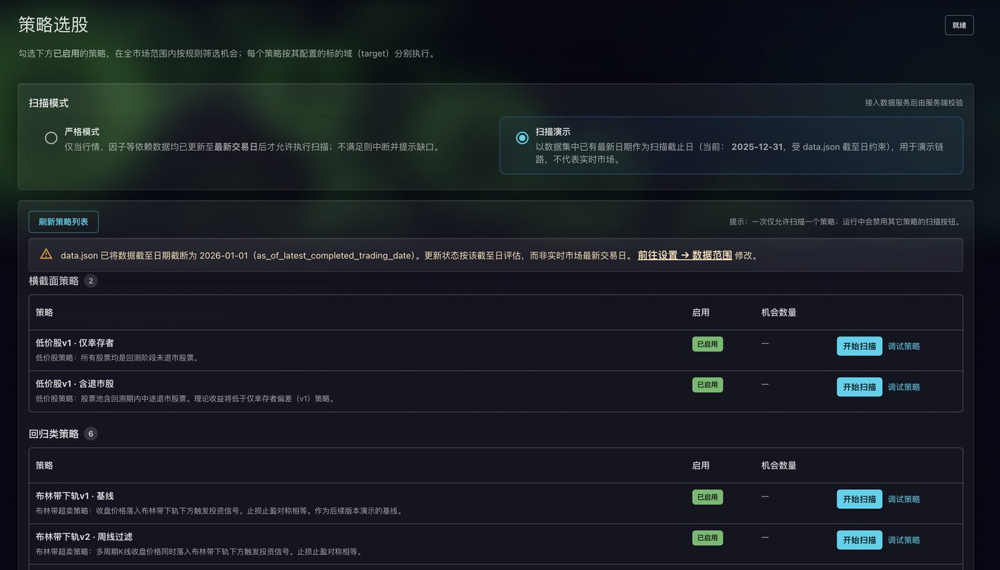

For a dry run only, choose **Scan demo** mode. The app pretends “today” is the day after your local data’s last trading day, then runs the scan at that synthetic as-of.

That is a simple end-to-end path from backtest to scan—there is more in NTQ to explore.

## Support the project

If NTQ is useful and you want to follow it, a **Star** on [GitHub](https://github.com/garnet1985/new-tea-quant) or [Gitee](https://gitee.com/garnet/new-tea-quant) is genuine support for a personal open-source effort.

This is my first serious open-source project; your recognition and feedback keep the work going. Thank you!

### Data notes

1. For a **larger (~3 years, full A-share) package**: register at **[new-tea.cn](https://new-tea.cn)**, leave **only one** zip under `initialization/data/` (move the old demo zip aside), then run `python cli.py id` (`-f` forces a full re-import). You can point a different DB name to keep demo and full data side by side (`userspace/system/config/database/`).
2. **Bring your own data source** (e.g. Tushare): see [userspace/extensions/data_source/README.md](userspace/extensions/data_source/README.md).
3. Demo data and strategies are for learning/research only—not live trading or commercial use.

### Disclaimers

This is still unofficial **v0.x**: API stability is not guaranteed until 1.0. (Before 1.0, APIs are at most beta.) See [CHANGELOG.md](CHANGELOG.md).

## Common commands (`cli.py`)

Layered backtest and scan (full list: `python cli.py -h`):

```bash
python cli.py se --strategy demo/regression/rsi/rsi_v1_without_value_anchor   # Enumerate
python cli.py sp --strategy demo/regression/rsi/rsi_v1_without_value_anchor   # Price layer
python cli.py so --strategy demo/regression/rsi/rsi_v1_without_value_anchor   # Portfolio layer
python cli.py c  --strategy demo/regression/rsi/rsi_v1_without_value_anchor   # Market scan
python cli.py t  --scenario demo/market_cap_tier                              # Feature tags
```

Prefer an explicit `--strategy`; add `-f` to force recalculation.

---

## Fun time: How do AIs rate NTQ?

> Third-party AI comments after reading some NTQ core files/docs—**for fun**, with **full reply screenshots**. **Not ads**, not official AI positions; models can be overly optimistic—judge from the repo yourself.  
> You are welcome to ask your own AI; make it read core code first, or expect severe hallucinations.

<details>
<summary><strong>Gemini 3.1 Pro</strong> (expand)</summary>


</details>

<details>
<summary><strong>GPT-5.5</strong> (expand)</summary>


</details>

<details>
<summary><strong>Claude Sonnet 4.6</strong> (expand)</summary>


</details>

<details>
<summary><strong>DeepSeek</strong> (expand, 6 screens stitched)</summary>


</details>

<details>
<summary><strong>Gitee Assistant</strong> (expand)</summary>


</details>

---

## Typical use cases

| Goal | Suggested path |
|------------|----------|
| **Does this signal fire?** | Web **Strategy Design** → demo → **Enumerate** → count & distribution |
| **Does a trigger make money on price?** | After enum → **Price backtest** → click a stock for entries/exits |
| **Survive with limited capital?** | After price layer → **Portfolio simulation** → curves & holdings |
| **Monthly low-price / Top N across A-shares** | See `demo/cross_sectional/low_price/`, **calendar_slice** mode |
| **Share one factor across strategies** | Run **Tag** (`cli.py t`), reference it in settings |
| **Screen with latest bars** | Refresh data → **`cli.py c`** or Web scan (notify via your Adapter) |

---

## Upgrade

1. Pull latest **master**, **keep** `userspace/`, overwrite the rest.  
2. Run `python install.py` for deps; if release notes ask for data re-import, see **Data notes**.  
3. Daily start: `python launcher.py`.

---

## License & support

- **License:** [Apache 2.0](LICENSE) · **Changelog:** [CHANGELOG.md](CHANGELOG.md)
- **Feedback / contribute:** [SUPPORT.md](SUPPORT.md) · [CONTRIBUTING.md](CONTRIBUTING.md) · [SECURITY.md](SECURITY.md)
- **Website:** [new-tea.cn](https://new-tea.cn)

**Disclaimer:** For learning and research only. Not investment advice; backtests do not predict future results.

<details>
<summary>Developer appendix (branches, devcli, tests, docs)</summary>

**Layout:** `core/` framework · `userspace/` strategies & config (kept on upgrade) · `userspace/strategies/demo/` demos · [docs/README.md](docs/README.md)

**Branches:** `master` for releases; branch `feature/*` / `bugfix/*` from `dev`; `hotfix/*` only from `rc`. Do not PR straight to `master`.

**Dev:** `python devcli.py -h` (`ui` · `uk` · `csc`) · Docker: [docs/docker.md](docs/docker.md)

**Tests / deps:**

```bash
./venv/bin/python -m pytest   # pip install -r requirements-dev.txt first
python3 -m piptools compile --output-file requirements.txt requirements.in
```

</details>
