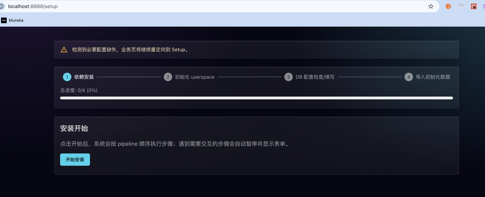
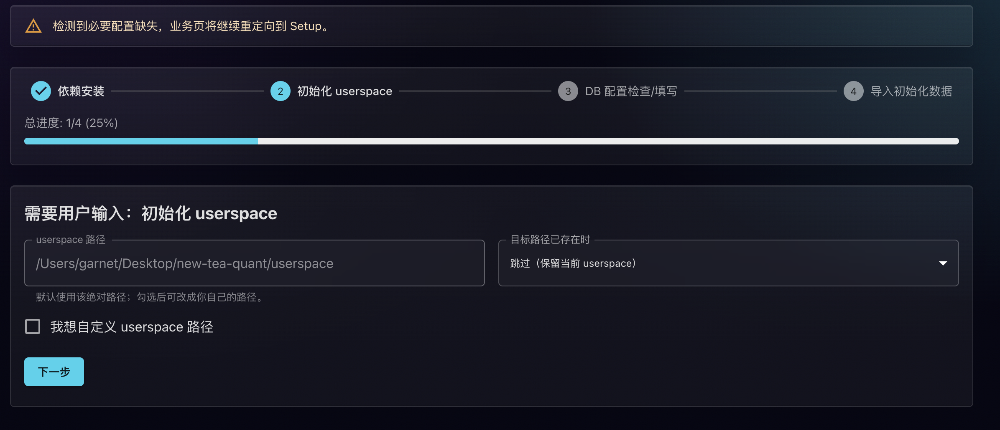
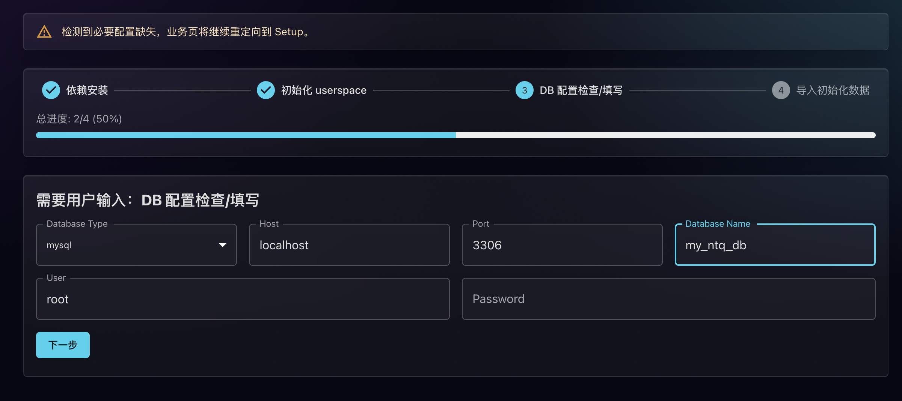
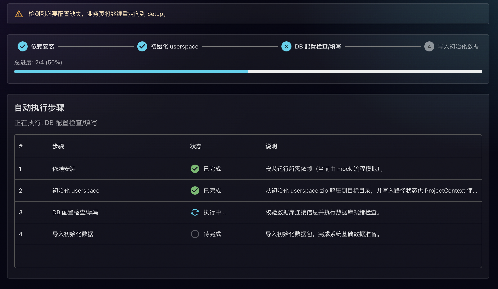
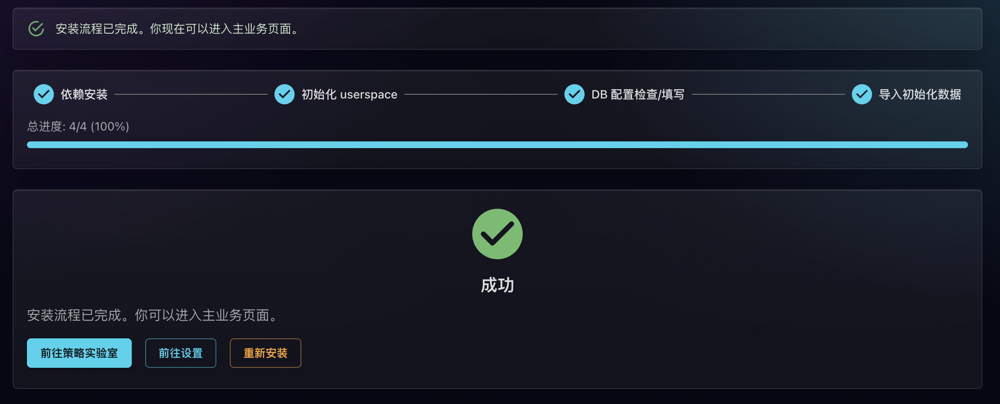

# New Tea Quant (NTQ) - A-Share Quant Research Framework

<br/>

<p align="center">
  
</p>

<p align="center">
  <a href="CHANGELOG.md"></a>&nbsp;
  <a href="#"></a>&nbsp;
  <a href="#"></a>&nbsp;
  <a href="https://github.com/garnet1985/new-tea-quant/actions/workflows/ci.yml"></a>&nbsp;
  <a href="LICENSE"></a>
</p>

> For the **canonical, fully maintained documentation** (Chinese), see **[README.md](README.md)**.

Author: Garnet Xin & His AI dude

<a href="https://github.com/garnet1985/new-tea-quant"></a>&nbsp;
<a href="https://gitee.com/garnet/new-tea-quant"></a>&nbsp;
<a href="https://new-tea.cn"></a>

## Current release (v0.4.x)

Since **v0.4.0**, NTQ has supported **embedded DuckDB** file storage. As of **v0.4.0**:

- **DuckDB is the default** — you only need **Python 3.9+** to run; **MySQL / PostgreSQL remain optional** in the setup wizard.
- **Engine / pipeline updates** — full layered backtests are roughly **6× faster** than before. See [CHANGELOG.md](CHANGELOG.md).

> **Tip:** This file is a shorter English overview. Screenshots below are from the Chinese UI; labels on your screen may read in Chinese.

### What is NTQ?

**NTQ (New Tea Quant)** is a local quantitative research framework for A-share strategies. It helps you turn ideas into evidence-backed conclusions with **layered backtesting**:

1. **Opportunity enumeration** — when and on which stocks does your logic trigger?
2. **Price-factor validation** — how does a single round-trip perform under fees and slippage?
3. **Capital / portfolio simulation** — does the idea still work with position limits and cash constraints?

You also get a **Strategy Lab Web UI** (backtests, reports, version compare), CLI tools, reproducible snapshots, and optional full-market scanning.

> NTQ is free and open source (Apache 2.0). Market data, notifications, and live trading require your own third-party accounts and integrations.

### Tech stack

- **Language**: Python 3.9+
- **Database**: **DuckDB** (default, file-based under `userspace/system/db/`), or **MySQL / PostgreSQL** if you choose them in setup
- **Web UI**: pre-built assets are in the repo — **Node.js is not required** for normal use (`python launcher.py`)
- **License**: Apache 2.0

---

## Quick start (about 5 minutes)

**Goal:** bring up the stack and run the built-in **`example`** strategy.

### Prerequisites

- **Python 3.9+**. Install guide (Chinese): [install-python](https://new-tea.cn/zh-hans/install-python).
- **No separate database server required** for the default DuckDB path.
- **MySQL or PostgreSQL** only if you opt out of DuckDB in the wizard (Chinese guide: [install-database](https://new-tea.cn/zh-hans/install-database)).

### Step 1: Get the code

Either:

- **Git clone** (recommended):

```bash
git clone https://github.com/garnet1985/new-tea-quant.git
cd new-tea-quant
```

- **Download ZIP**: on the GitHub repo page use **Code → Download ZIP**, extract, and open a terminal in the **`new-tea-quant`** root (the folder that contains `launcher.py`).

### Step 2: Start the setup wizard

From the **repository root**, run one of:

```bash
python launcher.py
```

If `python` is not 3.9+, try:

```bash
python3 launcher.py
```

The script ensures the virtual environment, starts **BFF + frontend**, and opens the browser to the **Setup** wizard.

### Step 3: Complete setup in the browser

Follow the on-page steps. Reference screenshots (UI may be Chinese):

**Figure 1** — dependency install: click **「开始安装」** and wait.



**Figure 2** — **userspace** root: use the default path or a custom directory.



**Figure 3** — **database**: the wizard defaults to **DuckDB** (no extra server). To use **MySQL / PostgreSQL**, configure your server first, then enter connection details in the wizard.



**Figure 4** — data import and remaining steps (may take a while).



**Figure 5** — when finished, open **Strategy Lab**.



### Run the `example` strategy

**Web (recommended):**

```bash
python launcher.py
```

Open Strategy Lab, select **`example`**, and run enum / price / capital steps.

**CLI (price layer example):**

```bash
python cli.py -sp --strategy example
```

Enumeration: `python cli.py -se --strategy example`  
Capital simulation: `python cli.py -sa --strategy example`

> **Note:** Root **`python install.py`** is for **first-time CLI install**. For a **larger demo ZIP** from the site, place a single zip under `setup/init_data/` and run `python setup/steps/import_data/install.py` (add `--force` to re-import).

### More common commands (`cli.py`)

```bash
python cli.py -h
python cli.py -sc --strategy example   # scan (default entry)
python cli.py -t                        # labels / features
```

Use **`--strategy`** when multiple strategies are enabled. Older docs mentioning `start.py` are obsolete — use **`cli.py`**.

Edit files under `userspace/strategies/` to customize settings and workers.

---

## Developer commands (`devcli.py`)

From the repository root (local dev / troubleshooting):

```bash
python devcli.py -h
```

| Purpose | Example |
|---------|---------|
| Start UI (free ports, then `launcher.py -d`) | `python devcli.py -ui` |
| Kill processes on ports 8000 / 8888 | `python devcli.py -kui` |
| Clear simulation **disk + DB** workbench cache | `python devcli.py -csc` (same as `-cu`) |
| Clear **DB** workbench snapshot table only | `python devcli.py -cdc` |
| Delete strategy **`results/`** dirs only | `python devcli.py -cmc` |
| DuckDB WAL checkpoint | `python devcli.py -dbc` |

HTTP cache APIs: see [db-cache-service.md](core/modules/strategy/docs/db-cache-service.md) §8 (V2-11 / V2-12).

---

## Data

- The repo ships with a **small demo dataset** for a fast first run.
- For a **larger (~3-year) demo pack**, register on **[new-tea.cn](https://new-tea.cn)**, download the ZIP, clear **`setup/init_data/`**, place **one** zip there, then run `python setup/steps/import_data/install.py`.
- **Your own data source** (e.g. Tushare): [userspace/extensions/data_source/README.md](userspace/extensions/data_source/README.md).

---

## Documentation & website

- Official site (Chinese, richer docs): **[new-tea.cn](https://new-tea.cn)**
- Canonical README (Chinese): **[README.md](README.md)**
- Offline doc index: [docs/README.md](docs/README.md)

---

## Testing

```bash
python -m pytest
```

Please ensure tests pass before submitting a PR.

---

## License & disclaimer

This project is licensed under **Apache License 2.0** (see [LICENSE](LICENSE)).  
**Disclaimer**: for learning and research only, not investment advice; backtest results do not guarantee future performance.
