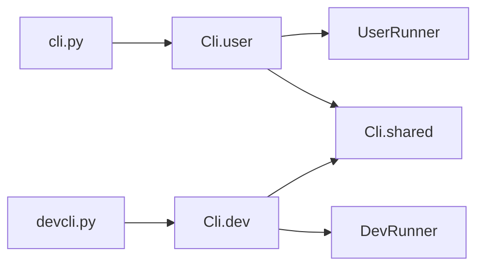

# CLI — 架构

**版本：** `0.4.2`

双入口命令行门面（Facade：对外统一入口类 `Cli`）：用户侧与开发侧分入口，共享命令行参数（argv）脚手架；业务处理函数留在各自包内，不对外导出。词条见 [glossary.yaml](../glossary.yaml)。

---

## 职责与边界（结论）

**负责**

- 对外唯一入口类 `Cli`，命名空间：`user` / `dev` / `shared`
- 仓库根入口脚本 `cli.py` / `devcli.py` 分发到门面类
- user / dev 各自的短别名与命令注册表
- 用户侧虚拟环境 / 安装的启动前检查（bootstrap）

**不负责**

- 具体业务动作的实现（交给 `system_actions`、各业务模块等）
- 把 `user/`、`dev/`、`shared/` 作为跨模块公开 import 面
- 合成单一 CLI 二进制（见 [DESIGN.md](./DESIGN.md)）

---

## 模块结构图

```text
core/infra/cli/
├── cli.py                 # 门面类 Cli 定义
├── __init__.py            # 仅导出 Cli
├── API.md
├── QUICKSTART.md
├── glossary.yaml
├── module_info.yaml
├── user/                  # 用户 CLI 实现（非公开 import）
│   └── __test__/          # user abbrev / parser unit
├── dev/                   # 开发 CLI 实现（非公开 import）
│   └── __test__/          # dev abbrev / parser unit
├── shared/                # 共用 argv 脚手架实现
├── __test__/              # 公开 API（test_api.py）
└── docs/
    ├── ARCHITECTURE.md
    └── DESIGN.md
```

仓库根：`cli.py` → `Cli.user`；`devcli.py` → `Cli.dev`。

---

## 架构图

```text
cli.py / devcli.py
        │
        ▼
   Cli（门面 / Facade）
   ├── user  → UserNamespace → UserBootstrap / UserRunner → user/*
   ├── dev   → DevNamespace  → DevRunner → dev/*
   └── shared → SharedNamespace（argv 展开 / help / 别名）；CliEnv（环境旗标）
```



---

## 数据流（若有）

```text
argv
  → Cli.shared.expand_argv（短别名 / 默认 version）
  → user 或 dev 的 argparse / runner
  → handler（业务侧）
  → 退出码 int
```

---

## 依赖（结论）

- `infra.project_context`：项目根与路径
- `infra.system_actions`：安装 / 更新等系统动作

---

## 相关文档

- [README](../README.md)
- [API.md](../API.md)
- [术语表](../glossary.yaml)
- [设计](./DESIGN.md)
- [快速开始](../QUICKSTART.md)
