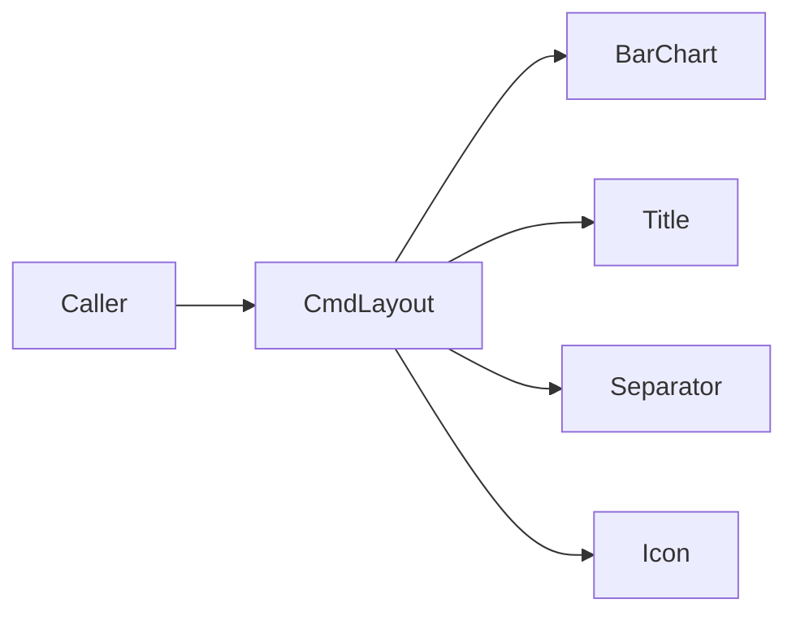

# 命令行布局 — 架构

**版本：** `0.4.1`

为终端报告提供纯文本排版片段：标题、分割线、图标、水平条形图。对外唯一入口为门面类 `CmdLayout`。词条见 [glossary.yaml](../glossary.yaml)。

---

## 职责与边界（结论）

**负责**

- 门面类 `CmdLayout` 与命名空间：`bar_chart` / `title` / `separator` / `icon`
- 生成可打印字符串（及可选直接打印到流）
- 跨平台默认：条形 / 分割用 ASCII；图标按终端能力在 emoji 与 ASCII 间切换

**不负责**

- 策略报告业务内容与指标计算（调用方组装）
- GUI / Web 图表组件
- 把内部实现类（`Title`、`BarChart`、`IconService` 等）作为跨模块公开 import 面

---

## 模块结构图

```text
core/infra/cmd_layout/
├── cmd_layout.py          # 门面类 CmdLayout
├── __init__.py            # 仅导出 CmdLayout
├── API.md
├── QUICKSTART.md
├── glossary.yaml
├── module_info.yaml
├── bar_chart/
├── title/
├── separator/
├── icon/
├── __test__/
└── docs/
    ├── ARCHITECTURE.md
    └── DESIGN.md
```

---

## 架构图

```text
调用方（strategy report / setup / …）
        │
        ▼
   CmdLayout（门面 / Facade）
   ├── bar_chart → 分布 / 直方图字符串
   ├── title     → banner / section
   ├── separator → line / thick / star / blank
   └── icon      → get / i / supports_emoji
```



---

## 数据流（若有）

```text
分桶或连续样本 / 标题文本 / 图标名
  → CmdLayout.<namespace>.*
  → str（可选 print 到 stdout 或指定 stream）
```

---

## 依赖（结论）

- 无模块级 YAML 依赖

---

## 相关文档

- [README](../README.md)
- [API.md](../API.md)
- [术语表](../glossary.yaml)
- [设计](./DESIGN.md)
- [快速开始](../QUICKSTART.md)
