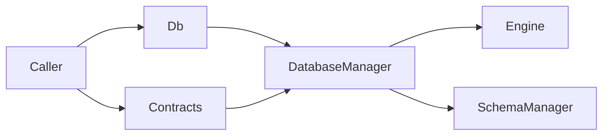

# Database — 架构

**版本：** `0.3.1`

统一数据库基础设施：门面 `Db` + 实现包 `core/`（按 backend 挂载 Engine）。词条见 [glossary.yaml](../glossary.yaml)。

---

## 职责与边界（结论）

**负责**

- 按配置 mount 一个 backend Engine（mysql / postgresql / duckdb）
- Schema 加载、DDL、结构迁移（`core/migration`）
- 表级 CRUD、批量写入、DuckDB 多存储域与 WAL / worker 池协作原语

**不负责**

- 业务领域逻辑（`core/modules/*`）
- 应用升级流水线编排（updater）
- 把 `core/` 内部路径长期当作跨模块公开 API（应经 `Db` / `contracts`）

---

## 模块结构图

```text
core/infra/db/
├── db.py                 # 门面 Db
├── contracts.py          # 跨模块契约
├── __init__.py           # 仅导出 Db
├── API.md / QUICKSTART.md / glossary.yaml / module_info.yaml
├── core/                 # 实现
│   ├── db_manager.py
│   ├── schema_manager.py
│   ├── migrate_manager.py
│   ├── storage_registry.py
│   ├── engines/          # mysql | pgsql | duckdb | shared | abc
│   │   └── …/__test__/   # 含 pgsql 与 mysql 对称最小套件
│   ├── migration/
│   └── table_queriers/
├── __test__/             # test_api + 少量 integration
├── core/**/__test__/     # 功能包单测（下沉；helper 包可不索引业务 case）
└── docs/
    ├── ARCHITECTURE.md   # 模块总览（SSOT）
    ├── DESIGN.md
    ├── storage-domains.md
    └── （engines 细部见 core/engines/ARCHITECTURE.md）
```

---

## 架构图

```text
调用方
  → Db（门面） / contracts（DbBaseModel, Field, …）
       → DatabaseManager
            → Engine (mysql | pgsql | duckdb)
                 ├── connector
                 ├── table_operator
                 └── duckdb: write_pipeline / process_pool_scope / …
            → SchemaManager / StorageRegistry
```



---

## 数据流（若有）

```text
配置（ProjectContext）
  → DatabaseManager.initialize
  → Db.engine.build_meta / create（或 EngineFactory）→ engine.initialize
  → 查询 / 写入 / 迁移
```

---

## 依赖（结论）

- `infra.project_context`：配置与路径

---

## 相关文档

- [README](../README.md)
- [API.md](../API.md)
- [术语表](../glossary.yaml)
- [设计](./DESIGN.md)
- [存储域](./storage-domains.md)
- [快速开始](../QUICKSTART.md)
