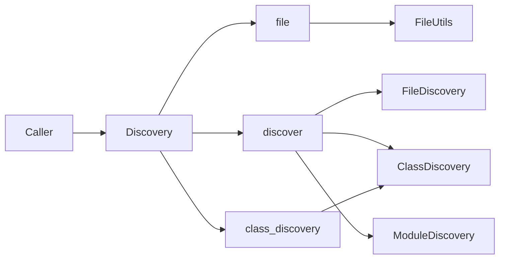

# Discovery — 架构

**版本：** `0.4.0`

统一发现基础设施：门面 `Discovery` + 实现包 `core/`。词条见 [glossary.yaml](../glossary.yaml)。

---

## 职责与边界（结论）

**负责**

- 单文件查找 / 读写（JSON、YAML、文本、Python 配置变量）
- 目录树批量发现文件与目录
- 按包路径与命名模式发现子类、模块级对象；可选进程内缓存

**不负责**

- 业务基类定义（data_source / strategy / tag 等）
- 配置热更新、文件监视、跨进程缓存失效
- 把 `core/` 内部路径长期当作跨模块公开 API

---

## 模块结构图

```text
core/infra/discovery/
├── discovery.py          # 门面 Discovery
├── contracts.py          # DiscoveryConfig / DiscoveryResult / …
├── __init__.py           # 仅导出 Discovery
├── API.md / QUICKSTART.md / glossary.yaml / module_info.yaml
├── core/                 # 实现
│   ├── namespaces.py
│   ├── file_utils.py
│   ├── file_discovery.py
│   ├── class_discovery.py
│   ├── module_discovery.py
│   └── __test__/         # 包内单测
├── __test__/             # 公开 API 测试 + TEST_CASES.md
└── docs/
```

---

## 架构图

```text
调用方
  → Discovery（门面）
       ├── file        → FileUtils
       ├── discover    → FileDiscovery / ClassDiscovery / ModuleDiscovery
       └── class_discovery → ClassDiscovery + DiscoveryConfig
```



---

## 数据流（若有）

```text
Discovery.discover.subclasses(...)
  → DiscoveryConfig
  → ClassDiscovery.discover(base_module_path)
  → 子包 import + 子类筛选
  → {key: class}
```

---

## 相关文档

- [DESIGN.md](./DESIGN.md)
- [API.md](../API.md)
