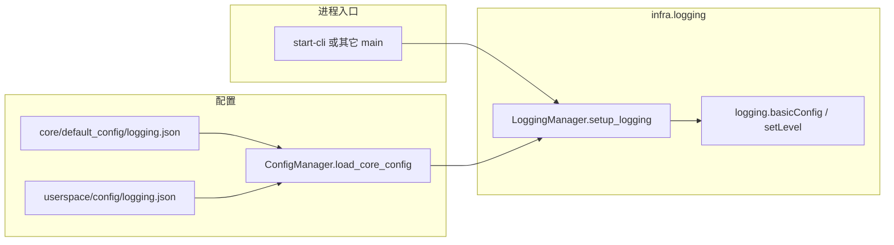

# Logging 架构文档

**版本：** `0.2.0`

---

## 模块介绍

`infra.logging` 提供单一的日志初始化入口 `LoggingManager`，在进程内将标准库 `logging` 的根 logger 与可选的子 logger 级别对齐到项目配置，依赖 `infra.project_context` 的 `ConfigManager` 加载 `logging` 配置段。

---

## 模块目标

- 在应用入口一处完成全局日志配置，避免分散调用 `logging.basicConfig`。
- 与默认配置 / 用户空间覆盖机制一致：`core/default_config/logging.json` 与 `userspace/config/logging.json` 合并结果作为事实来源（当未显式传入 `config` 时）。
- 多次调用初始化幂等，避免重复挂载 handler 或反复覆盖级别。

---

## 模块职责与边界

**职责（In scope）**

- 从配置字典或 `ConfigManager.load_core_config("logging", ...)` 读取 `level`、`format`、`datefmt`、`module_levels`。
- 在根 logger 无 handler 时使用 `logging.basicConfig`；若已有 handler，则仅更新根级别。
- 按配置中的 `module_levels` 为指定名称的 logger 设置级别。

**边界（Out of scope）**

- 不配置 `FileHandler`、`RotatingFileHandler`、第三方日志库或异步 handler（当前实现仅面向控制台等由 `basicConfig` 建立的默认行为）。
- 不负责日志内容规范、敏感信息脱敏、分布式 trace id。
- 不替代业务模块自行 `logging.getLogger(__name__)` 的惯用法；仅提供初始化与可选的 `get_logger` 包装。

---

## 依赖说明

- **模块依赖（`module_info.yaml`）**：`infra.project_context`（通过 `ConfigManager` 加载配置）。
- **运行时**：Python 标准库 `logging`。

---

## 工作拆分

- **`LoggingManager`**（`logging_manager.py`）：`setup_logging` 与 `get_logger` 的类方法 / 静态方法载体；维护类级 `_configured` 以实现幂等。

---

## 架构 / 流程图

---

## 相关文档

- [DESIGN.md](DESIGN.md) — 配置键与 `start-cli` 交互。
- [API.md](API.md) — `LoggingManager` 方法说明。
- [DECISIONS.md](DECISIONS.md) — 设计取舍与后续演进方向。
