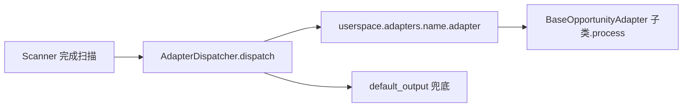

# Adapter 架构文档

**版本：** `0.2.0`

---

## 模块介绍

`modules.adapter` 定义策略扫描产物的**消费侧扩展点**：用户继承 `BaseOpportunityAdapter` 实现 `process`，将机会列表与上下文（日期、策略名、汇总等）输出或转发。框架在 **`strategy`** 的 Scanner 管线末尾通过 **`AdapterDispatcher`** 按配置名从 `userspace.adapters.<name>.adapter` 动态加载并执行；本模块还提供 **`validate_adapter`** 供设置校验，以及 **`HistoryLoader`** 读取价格模拟落盘结果以辅助展示。

---

## 模块目标

- 用统一基类与目录约定降低「扫描之后做什么」的接入成本。
- 与策略 Scanner 配置（`scanner.adapters`）对齐，支持多 adapter 顺序调用。
- 在无可用 adapter 或全部失败时，由基类提供 **`default_output`** 作为兜底控制台输出。

---

## 工作拆分

- **`BaseOpportunityAdapter`**（`base_adapter.py`）：抽象 `process`；从 `userspace.adapters.<adapter_name>.settings` 加载可选 `settings` / `config`；提供 `get_config`、日志封装、`default_output`。
- **`validate_adapter`**（`adapter_validator.py`）：校验模块可导入、存在继承基类的具体类、可实例化且 `process` 可调用。
- **`HistoryLoader`**（`history_loader.py`）：静态方法加载单股统计与会话汇总 JSON（依赖策略结果目录布局）。
- **协作组件（不在本包内）**：**`AdapterDispatcher`**（`core/modules/strategy/components/scanner/adapter_dispatcher.py`）负责运行时加载与异常时的兜底逻辑；**`ScannerSettings`** 在校验阶段调用 **`validate_adapter`**。

---

## 依赖说明

- 见 `module_info.yaml`：**`modules.strategy`**（`Opportunity` 模型；`HistoryLoader` 使用的版本与路径管理器）。

---

## 模块职责与边界

**职责（In scope）**

- 定义 adapter 契约与 userspace 目录/模块约定。
- 提供校验函数供策略设置使用。
- 提供读取已落盘模拟结果摘要的辅助类。

**边界（Out of scope）**

- 不负责调度扫描、不实现具体业务 adapter（由 `userspace/adapters/*` 提供）。
- 不包含下单、实盘交易或风控执行。
- 不实现 `AdapterDispatcher`（归属 `modules.strategy`）。

---

## 架构 / 流程图

设置校验（配置加载或 CLI 前）：

---

## 相关文档

- [DESIGN.md](DESIGN.md) — userspace 布局与 `context` 字段。
- [API.md](API.md) — 类型与方法签名。
- [DECISIONS.md](DECISIONS.md) — 关键取舍。
