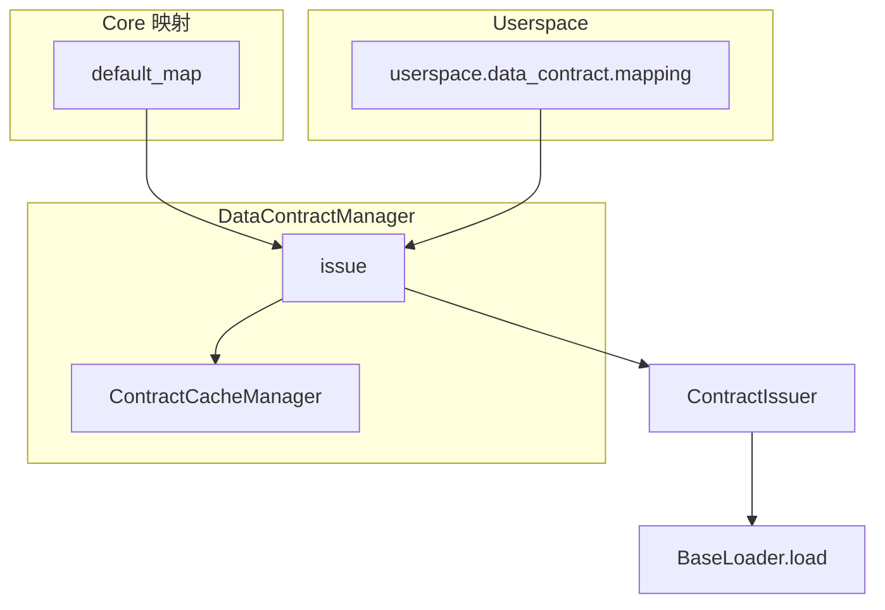

# Data Contract 架构文档

**版本：** `0.2.0`

---

## 模块介绍

`modules.data_contract` 将「策略/标签声明的数据依赖」收敛为 **`DataKey` → `DataSpec`** 的路由：由 **`ContractIssuer`** 装配 **`TimeSeriesContract` / `NonTimeSeriesContract`** 句柄并绑定 **`BaseLoader`** 子类；**`DataContractManager.issue`** 在合并后的映射上执行参数校验、缓存 key 计算、可缓存 GLOBAL 数据的物化；**`ContractCacheManager`** 提供 global / per-strategy 两层存储与生命周期方法。

---

## 模块目标

- **声明式取数**：业务只使用稳定的 `DataKey` 与显式 `entity_id` / `start` / `end` / `**params`，由 mapping 决定如何加载。
- **可合并扩展**：`userspace.data_contract.mapping` 导出映射表，与 core **按 `DataKey` 合并**，重复键 fail-fast。
- **缓存可控**：仅对部分 GLOBAL 规格写入缓存；PER_ENTITY 默认 **NONE**（不走路径缓存），由 loader 按需拉数。

---

## 工作拆分

- **`contract_const`**：`DataKey`、`ContractScope`、`ContractType` 枚举。
- **`mapping`**：`DataSpec` / `DataSpecMap`、`default_map`（core 全表路由）。
- **`discovery`**：`discover_userspace_map()` 导入 `userspace.data_contract.mapping` 并规范化键。
- **`contract_issuer`**：由 `DataSpec` 构造 contract、注入 `context`（如 `stock_id`）、合并 `defaults` 与 `**override_params` 为 `loader_params`。
- **`data_contract_manager`**：`issue` 主流程、时序窗口与 `entity_id` 校验、缓存读写与 payload 克隆。
- **`cache`**：`ContractCacheManager`、两层 `Store`、`resolve_cache_scope`（按 scope+type 决定 GLOBAL / PER_STRATEGY / NONE）。
- **`contracts`**：`DataContract` 基类与 `validate_raw`（时序/非时序子类实现轻量校验）。
- **`loaders`**：按数据类型实现的 `BaseLoader.load(params, context)`。

---

## 依赖说明

见 `module_info.yaml`：**`modules.data_manager`**（取数）、**`infra.project_context`**（userspace 路径与 mapping 文件发现）。

---

## 模块职责与边界

**职责（In scope）**

- 维护 core `default_map` 与 userspace 合并规则。
- 签发句柄、协调缓存与 `load` 参数。

**边界（Out of scope）**

- 不负责持久化 schema 迁移、不负责定义数据库表（由 data_manager / DB 层负责）。
- 不替代 `DataManager` 的 SQL 与业务查询实现（loader 内部调用）。

---

## 架构 / 流程图

---

## 相关文档

- [DESIGN.md](DESIGN.md)
- [API.md](API.md)
- [DECISIONS.md](DECISIONS.md)
- [CONCEPTS.md](CONCEPTS.md)
- 多源 **`DataContract.data`** 的 **`as_of`** 前缀累计视图：[`modules.data_cursor`](../../data_cursor/README.md)
