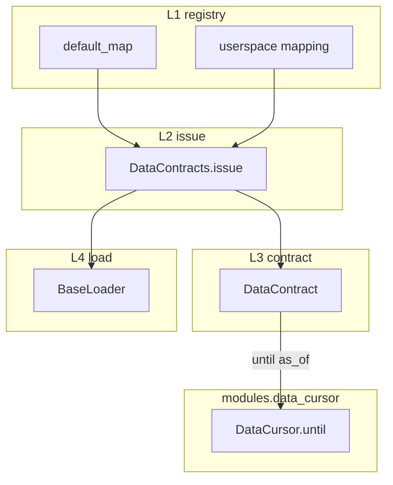

# Data Contract 架构文档

**版本：** `0.4.0`（分层 `core/` + Facade **`DataContracts`**；句柄 **`DataContract.until`** 委托 **`modules.data_cursor`**）

---

## 模块介绍

`modules.data_contract` 将「策略/标签声明的数据依赖」收敛为 **`DataKey` → `DataSpec`** 路由，经 **注册 → 签发 → 句柄 → 装载 → 缓存** 流水线交付。**`DataContract`** 句柄在数据物化后可通过 **`until(as_of)`** 做 PIT 前缀裁剪（实现委托独立模块 **`modules.data_cursor`**，本模块不内嵌 cursor 包）。

---

## 分层结构

```text
modules.data_contract/
├── data_contract.py      # Facade: DataContracts
├── contracts.py          # 跨模块契约 types（DataKey, DataContract, IssueResult, …）
├── api.yaml / glossary.yaml / OVERVIEW.md
├── core/
│   ├── registry/         # L1 路由注册
│   ├── issue/            # L2 签发
│   ├── contract/         # L3 句柄与信封（DataContract.until → data_cursor）
│   ├── load/             # L4 Loader
│   ├── cache/            # L5 进程内缓存
│   └── launcher/         # BFF catalog
├── docs/
└── __test__/
```

| 层 | 包 | 核心类型 | 职责 |
| --- | --- | --- | --- |
| **L1 registry** | `core/registry/` | `DataKey`, `DataSpecMap` | core + userspace 映射合并 |
| **L2 issue** | `core/issue/` | `ContractIssuer`, `DataContractManager` | 参数校验、cache、loader 物化 |
| **L3 contract** | `core/contract/` | `DataContract`, `IssueResult` | 句柄；**`until` / `reset_view`** 委托 data_cursor |
| **L4 load** | `core/load/` | `BaseLoader`, … | 取数 IO；`load_batch` |
| **L5 cache** | `core/cache/` | `ContractCacheManager` | GLOBAL / per-strategy store |

**与 data_cursor 的关系：** `modules.data_cursor` 仍为独立模块；`DataContract.until` 与多源 `DataCursor` 共用同一套前缀推进逻辑。跨模块 import cursor 类型用 **`core.modules.data_cursor`**，句柄类型用 **`contracts.py`**。

---

## 架构 / 流程图


```mermaid
flowchart TB
  subgraph L1 [L1 registry]
    M[default_map]
    U[userspace mapping]
  end
  subgraph L2 [L2 issue]
    F[DataContracts.issue]
  end
  subgraph L3 [L3 contract]
    DC[DataContract]
  end
  subgraph L4 [L4 load]
    L[BaseLoader]
  end
  subgraph DCUR [modules.data_cursor]
    CUR[DataCursor.until]
  end
  M --> F
  U --> F
  F --> L
  F --> DC
  DC -->|until as_of| CUR
```

---

## 模块职责与边界

**职责（In scope）**

- 维护映射、签发句柄、协调 cache 与 load。
- 句柄暴露 **`until(as_of)`** 裁剪 API（委托 data_cursor）。

**边界（Out of scope）**

- cursor 状态机实现细节（在 **`modules.data_cursor`**）。
- DB schema / SQL（data_manager）。

---

## 相关文档

- [OVERVIEW.md](../OVERVIEW.md)
- [modules.data_cursor](../../data_cursor/README.md)
- [DESIGN.md](DESIGN.md)
- [DECISIONS.md](DECISIONS.md)
