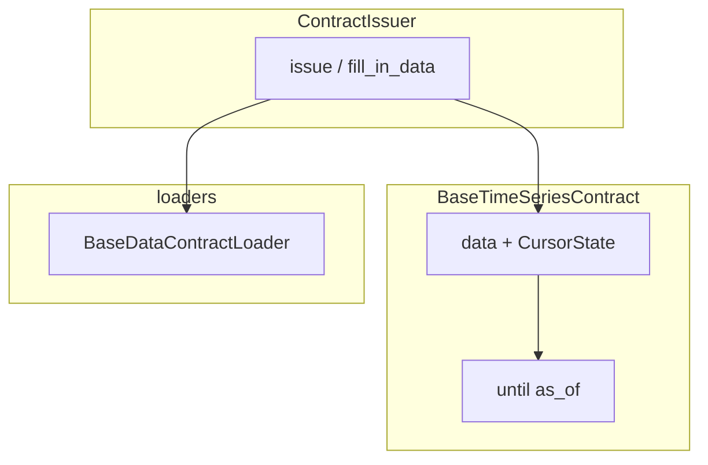

# Data Contract 架构文档

---

## 模块介绍

`modules.data_contract` 将「策略/标签声明的数据依赖」收敛为 **`DATA_KEY` → declaration/loader`**，经 **发现 → 签发 → 填充 → PIT 游标** 交付。PIT 前缀推进由时序基类 **`BaseTimeSeriesContract.until`** 完成（`CursorState` 内置，不再依赖独立 `data_cursor` 模块）。

---

## 分层结构

```text
modules.data_contract/
├── __init__.py           # ContractIssuer / DATA_KEY
├── contracts.py          # 跨模块公开类型
├── core/
│   ├── discovery/        # ContractIssuer
│   ├── base/             # Base*Contract（until / CursorState）
│   └── data_contracts/   # 各 key 的 declaration / loader / contract
├── docs/
└── __test__/
```

| 层 | 包 | 核心类型 | 职责 |
| --- | --- | --- | --- |
| **发现/签发** | `core/discovery/` | `ContractIssuer` | discover、`issue`、`fill_in_data` |
| **基类** | `core/base/` | `BaseTimeSeriesContract` | 时间窗、`until` / `reset_cursor` |
| **契约实现** | `core/data_contracts/` | 各 DATA_KEY | declaration + loader |

---

## 架构 / 流程图


```mermaid
flowchart TB
  subgraph Issue [ContractIssuer]
    F[issue / fill_in_data]
  end
  subgraph TS [BaseTimeSeriesContract]
    DC[data + CursorState]
    UNT[until as_of]
  end
  subgraph Load [loaders]
    L[BaseDataContractLoader]
  end
  F --> L
  F --> DC
  DC --> UNT
```

---

## 模块职责与边界

**职责（In scope）**

- DATA_KEY 发现与签发、loader 取数、时序 PIT 游标（`until`）。

**边界（Out of scope）**

- DB schema / SQL（**`modules.data_manager`**）。
- 策略/标签编排与进度落盘（各自模块）。

---

## 相关文档

- [OVERVIEW.md](../OVERVIEW.md)
- [DESIGN.md](DESIGN.md)
- [DECISIONS.md](DECISIONS.md)
