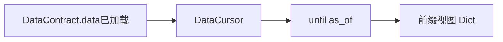

# Data Cursor 架构文档

**版本：** `0.2.0`

---

## 模块介绍

`modules.data_cursor` 提供 **`DataCursor`**：在多个 **数据源键**（`Hashable`）上各自维护 **扫描下标** 与 **累计列表**，对 **时序** 源按 **`time_field`** 与 **`as_of`** 做 **单调前进**；**非时序** 源始终返回 **全量行**。**`DataCursorManager`** 在单进程内按 **字符串名** 保存/重置/删除游标实例。

---

## 模块目标

- 与 **`DataContract`** 管线衔接：**`contract.data` 必须先非空**。
- 支持 **显式时间字段覆盖**（`time_field_overrides`），以应对同构键不同列名。
- **不**重新拉数、**不**修改 `contract` 本体，仅维护视图状态。

---

## 工作拆分

- **`data_cursor.py`**：`_CursorState`、`DataCursor`（`until` / `reset` / `from_rows`）。
- **`data_cursor_manager.py`**：**`DataCursorManager`** 薄封装。

---

## 依赖说明

见 `module_info.yaml`：**`modules.data_contract`**。

---

## 模块职责与边界

**职责（In scope）**

- 前缀切片与游标推进、日期规范化（委托 **`DateUtils.normalize`**）。

**边界（Out of scope）**

- 不签发/加载契约（**`DataContractManager.issue/load`**）。
- 不做跨源 join 或 SQL。

---

## 架构 / 流程图

---

## 相关文档

- [DESIGN.md](DESIGN.md)
- [API.md](API.md)
- [DECISIONS.md](DECISIONS.md)
