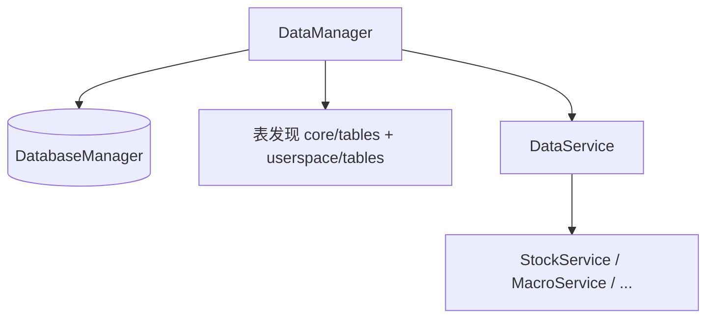

# Data Manager 架构文档

**版本：** `0.2.0`

---

## 模块介绍

`modules.data_manager` 提供 **Facade + 领域服务** 结构：`DataManager` 管理单例生命周期、数据库初始化与表模型注册；各领域逻辑放在 **`data_services/`**（如 `StockService` → `list` / `kline` / `tags` / `corporate_finance`），通过 **属性链** 显式访问（`data_mgr.stock.kline.load`），底层 **`DbBaseModel`** 仅由服务层使用。

---

## 模块目标

- 单一入口访问项目内主要业务表，封装 SQL 与表细节。
- 与 **`core/tables`、`userspace/tables`** 目录约定对齐，自动发现与注册。
- 保持 **进程级单例**（`force_new` 可破例），多进程场景每进程独立实例。

---

## 工作拆分

- **`DataManager`**（`data_manager.py`）：`DatabaseManager` 初始化、`create_all_tables`、`_discover_tables`、`register_table`、`get_table`、服务属性入口。
- **`DataService`**（`data_services/data_service.py`）：挂载 `stock`、`macro`、`calendar`、`index`、`db_cache`。
- **领域服务**：`data_services/stock/`、`macro/`、`calendar/`、`index/`、`db_cache/`、`ui_transit/` 等。
- **`helpers/`**：如 `filtering` 等通用工具。

---

## 依赖说明

见 `module_info.yaml`：**`infra.db`**、**`infra.project_context`**。

---

## 模块职责与边界

**职责（In scope）**

- 已落地表的数据读写、领域级查询封装、与 `DataManager` 绑定的 Model 实例化。

**边界（Out of scope）**

- 不负责数据源抓取调度（见 **`modules.data_source`**）。
- 不承担 **`DataKey` 契约签发**（见 **`modules.data_contract`**），但可被其 Loader 调用。

---

## 架构 / 流程图

---

## 相关文档

- [DESIGN.md](DESIGN.md)
- [API.md](API.md)
- [DECISIONS.md](DECISIONS.md)
- [data_services/README.md](../data_services/README.md)
