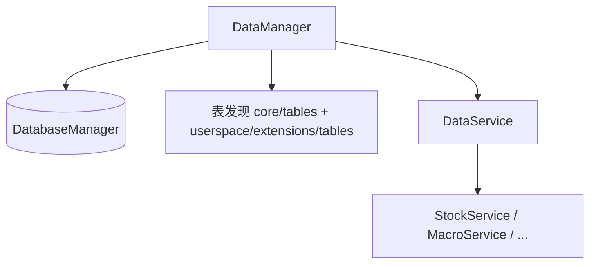

# Data Manager 架构文档

**模块：** `modules.data_manager` · **版本：** `0.4.0`

---

## 模块介绍

提供 **Facade + 领域服务**：`DataManager` 管理单例、库初始化与表注册；领域逻辑在 **`core/data_services/`**，经属性链访问（`data_mgr.stock.kline.load`）。

公开 Facade：**`DataManager`**。

---

## 分层结构

```text
modules.data_manager/
├── __init__.py              # 仅 DataManager
├── contracts.py             # BaseTableNames
├── core/
│   ├── data_manager.py      # Facade 实现
│   ├── enums.py
│   └── data_services/       # stock / macro / calendar / …
├── docs/
└── __test__/                # 公开 API 契约测
```

| 层 | 职责 |
| --- | --- |
| Facade | `DataManager`：`initialize`、表发现/注册、领域属性 |
| 协调 | `DataService`：挂载 stock / macro / calendar / index / db_cache / backup_restore |
| 领域 | 各 `*_service` 封装表读写 |

---

## 流程


```mermaid
flowchart TB
  DM[DataManager]
  DB[(DatabaseManager)]
  T[表发现 core/tables + userspace/extensions/tables]
  DS[DataService]
  SS[StockService / MacroService / ...]
  DM --> DB
  DM --> T
  DM --> DS
  DS --> SS
```

---

## 边界

**In scope：** 已落地表读写、领域查询、Model 实例化  
**Out of scope：** 抓取（`data_source`）；`DataKey` 签发（`data_contract`）

---

## 相关文档

- [DESIGN.md](./DESIGN.md)
- [API.md](../API.md)
- [glossary.yaml](../glossary.yaml)
