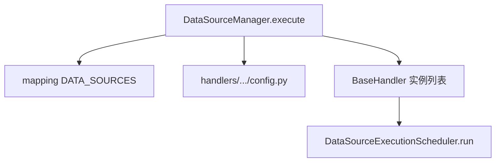

# Data Source 架构文档

**版本：** `0.2.0`

---

## 模块介绍

`modules.data_source` 将「抓取第三方数据并落入项目表」拆为：**配置发现**（`DataSourceManager`）→ **Provider 池**（userspace 包扫描）→ **Handler 实例**（每 key 一个实现类）→ **执行调度**（`DataSourceExecutionScheduler`：拓扑序、依赖注入、失败重试）。单表 schema 以 **`DataManager`** 绑定表的 **`load_schema()`** 为唯一来源。

---

## 模块目标

- 用 **mapping + CONFIG** 描述启用项与 handler 路径，避免硬编码列表。
- **串行满足跨数据源依赖**；单数据源内部可有 **ApiJob** 拓扑与限流执行（见 `service/`）。
- 与 **DB 表** 强绑定，输出字段与类型可校验。

---

## 工作拆分

- **`DataSourceManager`**：发现 mapping、加载各 `config.py`、解析 schema、反射加载 Handler 类并 `create_handler_instance`、发现全部 Provider。
- **`DataSourceExecutionScheduler`**：对 handler 列表拓扑排序、按序 `execute`、合并依赖数据源返回值、失败收集与后处理。
- **`BaseHandler`**：同步管线（`on_before_run`、预处理、执行 API 批次、标准化、保存等，见源码）。
- **`BaseProvider`**：第三方 API 封装与认证、声明式限流元数据。
- **`service/`**：`manager_helper`、`provider_helper`、`handler_helper`、`api_job_executor`、**renew** 子包等。

---

## 依赖说明

见 `module_info.yaml`。

---

## 模块职责与边界

**职责（In scope）**

- 配置发现、handler/provider 生命周期、调度与持久化钩子。

**边界（Out of scope）**

- 不负责 **`DataKey` 契约**（见 **`modules.data_contract`**）。
- 不实现具体券商/实盘下单。

---

## 架构 / 流程图

---

## 相关文档

- [DESIGN.md](DESIGN.md)
- [API.md](API.md)
- [DECISIONS.md](DECISIONS.md)
