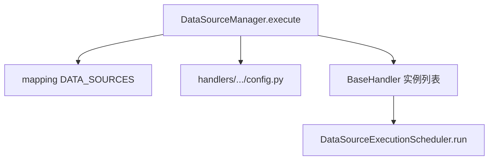

# Data Source 架构文档

**模块：** `modules.data_source` · **版本：** `0.2.0`

---

## 模块介绍

将「抓取第三方数据并落入项目表」拆为：**配置发现**（`DataSourceManager`）→ **Provider 池** → **Handler 实例** → **执行调度**（拓扑序、依赖注入）。单表 schema 以 **`DataManager`** 绑定表的 **`load_schema()`** 为唯一来源。

公开 Facade：**`DataSourceManager`**。

---

## 分层结构

```text
modules.data_source/
├── __init__.py                 # 仅 DataSourceManager
├── contracts.py                # BaseProvider / BaseHandler / ApiJob*
├── core/
│   ├── data_source_manager.py  # Facade 实现
│   ├── execution_scheduler.py
│   ├── enums.py / reserved_dependencies.py
│   ├── base_class / data_class / catalog / service / dev /
│   └── **/__test__/            # 实现测就近
├── docs/
└── __test__/                   # 公开 API 契约测
```

| 层 | 职责 |
| --- | --- |
| Facade | `DataSourceManager`：renew / execute / 发现 |
| 调度 | `DataSourceExecutionScheduler`：拓扑序执行 |
| Handler / Provider | userspace 实现 + `core/base_class` |
| service | 日期范围、管线、持久化、样本池等 |

日期范围由 **`DateRangeService` + `date_range_helper` + `RenewCommonHelper`** 计算。

---

## 流程


```mermaid
flowchart TB
  M[DataSourceManager.execute]
  MAP[mapping DATA_SOURCES]
  CFG[handlers/.../config.py]
  H[BaseHandler 实例列表]
  S[DataSourceExecutionScheduler.run]
  M --> MAP
  M --> CFG
  M --> H
  H --> S
```

---

## 边界

**In scope：** 配置发现、handler/provider 生命周期、调度与持久化钩子  
**Out of scope：** `DataKey` 契约（`data_contract`）；实盘下单

---

## 相关文档

- [DESIGN.md](./DESIGN.md)
- [API.md](../API.md)
- [glossary.yaml](../glossary.yaml)
