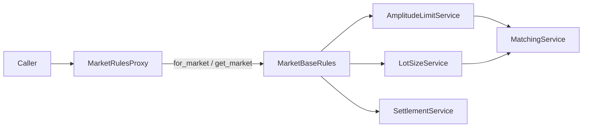

# Market Profile — 架构

**版本：** `0.2.0`

`modules.market_profile` 提供多市场制度规则（涨跌幅、整手、T+N 交收等）。对外仅暴露 **`MarketRulesProxy`**；规则实例为 **`MarketBaseRules`** 子类。

---

## 职责与边界（结论）

**负责**

- 内置市场 profile 注册与实例化
- 按配置解释涨跌幅、整手、交收规则
- 供策略 / 回测在交易规则判断前取规则对象

**不负责**

- 不拉行情、不持久化
- 不在本模块读取策略 `settings.py`
- 不在本模块实现 userspace 覆盖加载（若需扩展市场，改内置注册表或后续单独设计）

---

## 模块结构图

```text
market_profile/
├── __init__.py              # 导出 MarketRulesProxy
├── contracts.py             # MarketBaseRules, LotSizeResolved
├── API.md / glossary.yaml
├── __test__/test_api.py
└── core/
    ├── market_profile.py    # Facade 实现
    ├── base/                # MarketBaseRules
    ├── markets/             # 各市场 rules + settings + 注册表（内部）
    └── services/            # Matching / Amplitude / Lot / Settlement
```

---

## 架构图



---

## 相关文档

- [API.md](../API.md)
- [glossary.yaml](../glossary.yaml)
- [DESIGN.md](DESIGN.md)
