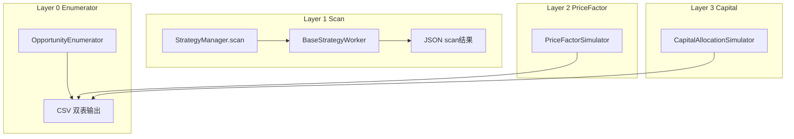

# Strategy 架构文档

**版本：** `0.2.0`

---

## 模块介绍

`modules.strategy` 在 **`userspace/strategies/<name>/`** 下发现策略： **`settings.py`** 定义整包配置，**`strategy_worker.py`** 提供继承 **`BaseStrategyWorker`** 的实现。框架侧 **`StrategyManager`** 负责 **扫描（scan）** 与 **逐日 simulate** 的多进程调度；**`OpportunityEnumerator`** 与两类 **Simulator** 提供 **枚举事实表 + 价格层/资金层** 的复用链路。**`data_classes/strategy_settings`** 将大 dict 拆成可校验的分块 settings；**`managers`** 管版本与路径；**`helpers`** 做发现、采样、Job 构建与统计。

---

## 模块目标

- **四层流水线**：枚举（CSV缓存）→ 扫描（JSON提示）→ 价格模拟 → 资金模拟，职责清晰、可单独迭代。
- **配置驱动**：少改框架、多改 userspace 配置与 Worker。
- **防泄露**：**`StrategyDataManager`** + DataCursor 在 simulate 路径按日切片。
- **可复用枚举结果**：Layer 2/3 共享同一次 **OpportunityEnumerator** 输出，避免重复全市场 on-bar 计算。

---

## 工作拆分

| 区域 | 职责 |
|------|------|
| `strategy_manager.py` | 发现策略、`scan` / `simulate`、**`ProcessWorker`**、结果委托 **`OpportunityService`** |
| `base_strategy_worker.py` | 子进程 Worker生命周期、`scan`单日 vs `simulate` 逐日、`scan_opportunity` 抽象 |
| `components/` | 枚举、扫描、双模拟器、数据管理、分析、机会存储、Session（**[组件索引](components/README.md)**） |
| `helpers/` | 策略发现、股票采样、Job 构建、统计摘要 |
| `managers/` | **VersionManager**、**DataLoader**、**ResultPathManager** |
| `models/` | **Opportunity**、**Investment**、**Event**、**Account** 等 |
| `data_classes/strategy_settings/` | 整包 settings 与各业务块 dataclass |

---

## 依赖说明

见根目录 **`module_info.yaml`**。

---

## 模块职责与边界

**职责（In scope）**

- 编排策略扫描、主线回测 simulate、枚举与模拟器入口；定义机会/投资等领域模型与落盘约定。

**边界（Out of scope）**

- 不包含实盘下单与券商接口；**`adapter`** 仅负责机会分发扩展，不承担交易执行。

---

## 架构 / 流程图

---

## 相关文档

- [DESIGN.md](DESIGN.md)
- [API.md](API.md)
- [DECISIONS.md](DECISIONS.md)
- [组件文档](components/README.md)
