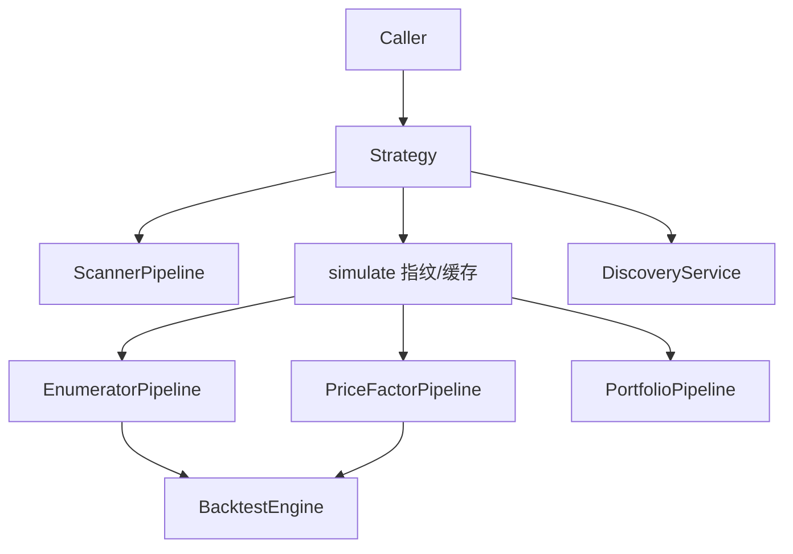

# Strategy — 架构

**版本：** `0.9.0`

`modules.strategy` 对外仅暴露 **`Strategy`**：机会扫描、模拟三步（enumerate / price_factor / portfolio）、决策者回放、结果摘要与策略发现。引擎经 BacktestEngine `RunCallbacks` 挂入回测；可变业务状态挂在 `JobContext.init`。

---

## 职责与边界（结论）

**负责**

- 策略包发现与 Facade 编排（指纹 → 缓存 → Pipeline）
- Scanner / Enumerator / PriceFactor / Portfolio 引擎与报告
- 决策者模式（enum version 下回放；人替换选谁 / 买多少）
- userspace hooks 契约（`StrategyHooks` / `StrategyContext`）
- 模拟产物路径与磁盘 version registry

**不负责**

- 不另起平行于 BacktestEngine 的调度 / Timeline / JobSession
- 不 deep-export 引擎实现（跨模块优先 `Strategy` + `contracts`）

硬约束细节见 [DESIGN.md](./DESIGN.md) 与 [notes/BOUNDARY_NOTES.md](./notes/BOUNDARY_NOTES.md)。

---

## 模块结构图

```text
strategy/
├── __init__.py              # 导出 Strategy
├── contracts.py             # hooks / 枚举 / 共享数据类
├── API.md / glossary.yaml
├── __test__/test_api.py     # 公开契约
└── core/
    ├── strategy.py          # Facade 实现
    ├── enums.py
    ├── hooks/
    ├── helpers/
    ├── services/            # discovery, entity_loader, fingerprint, artifacts, package, progress
    └── engines/
        ├── scanner/         # pipeline + job_builder / executor
        ├── enumerator/      # entity_based / slice_based
        ├── price_factor/
        ├── portfolio/       # 不走 BE
        ├── decision_maker/  # 资金回放；人替换选谁/买多少；不进 SimulateKind
        └── shared/
```

---

## 架构图


```mermaid
flowchart TB
  Caller --> Facade[Strategy]
  Facade --> Scan[ScannerPipeline]
  Facade --> Sim[simulate 指纹/缓存]
  Sim --> Enum[EnumeratorPipeline]
  Sim --> Price[PriceFactorPipeline]
  Sim --> Port[PortfolioPipeline]
  Enum --> BE[BacktestEngine]
  Price --> BE
  Facade --> Disc[DiscoveryService]
```

---

## 与 BacktestEngine

| 组件 | 职责 |
|------|------|
| BE | jobs 调度、Timeline、`JobContext`、slice 装载 |
| Strategy 引擎 | JobBuilder + JobExecutor + Pipeline |

portfolio 不用 BE；price_factor 业务在 after_task 事件回放。

---

## 相关文档

- [API.md](../API.md)
- [glossary.yaml](../glossary.yaml)
- [DESIGN.md](./DESIGN.md)
- [VERSIONING.md](./VERSIONING.md)
- [BOUNDARY_NOTES.md](./notes/BOUNDARY_NOTES.md)
- [DECISIONS.md](./notes/DECISIONS.md)
- [价格三层：qfq 信号 / hfq ROI / raw 成交](./PRICE_LAYERS.md)
- [资金层日频盯市风险比（未实现）](../core/engines/portfolio/docs/DAILY_MTM_RISK_RATIOS.md)
- [决策者模式：资金回测回放](./notes/DECISION_MAKER.md)
- [跨策略决策模拟（0.5.1）](./notes/DECISION_MAKER_CROSS.md)
