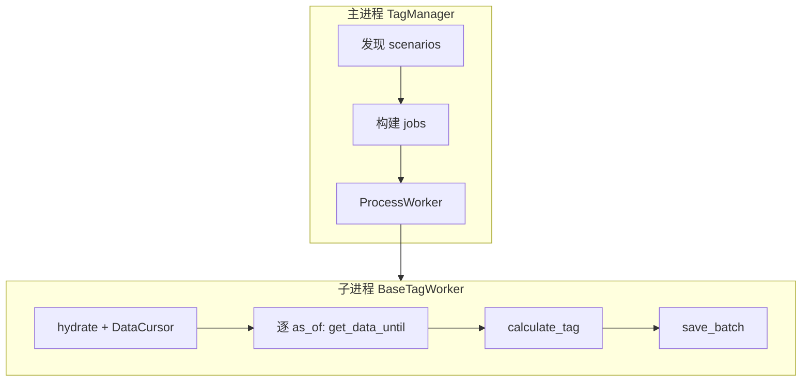

# Tag 架构文档

**版本：** `0.2.0`

---

## 模块介绍

`modules.tag` 将「场景化标签计算」编排为可并行流水线：**发现** `userspace/tags` 下各 Scenario → **解析** `settings` 与 **DataContract** → **按实体拆分 Job** → **`ProcessWorker` 子进程**中 **`BaseTagWorker`** 逐日 **`calculate_tag`** → **批量写入**标签表。历史输入由 **`TagDataManager`** 经 **`DataCursorManager`** 按 **`as_of_date`** 提供前缀视图。

---

## 模块目标

- **配置驱动**：场景目录 + `settings.py` + `tag_worker.py`，无需改框架代码即可扩展。
- **可复用资产**：标签落库后可被策略与下游多次读取，与「每次回测现算」解耦。
- **防泄露**：计算侧统一走 DataCursor 的 as_of 语义，不直接拼接「全历史」给业务逻辑。

---

## 工作拆分

- **`core/tag_manager.py`**：场景发现与缓存、`execute` / `refresh_scenario`、实体列表与 Job 构建、`ProcessWorker` 调度与汇总。
- **`core/base_tag_worker.py`**：子进程内生命周期（预处理 → 逐日打标 → 批量保存）与可重写钩子；抽象 **`calculate_tag`**。
- **`core/components/data_management/tag_data_manager.py`**：`hydrate_row_slots`、`rebuild_data_cursor`、`get_data_until`、`get_trading_dates` 等与契约/游标交互。
- **`core/components/helper/*`**：`TagHelper`、`JobHelper` 等编排辅助。
- **`core/models/*`**：`ScenarioModel`、`TagModel` 等与配置结构对应。
- **`core/config.py`**：`get_scenarios_root()`（委托 **`PathManager.tags()`**）。
- **`core/enums.py`**：`TagUpdateMode`、`TagTargetType`、`FileName` 等。

---

## 依赖说明

见根目录 **`module_info.yaml`**。

---

## 模块职责与边界

**职责（In scope）**

- Scenario 发现、校验与执行编排；TagWorker 生命周期与落库批次。

**边界（Out of scope）**

- 不负责数据源抓取与原始表写入（**`modules.data_source`** / **`modules.data_manager`**）。
- 不定义通用「横截面排名」类标签的框架能力（见 **`DECISIONS.md`**）。

---

## 架构 / 流程图

---

## 相关文档

- [DESIGN.md](DESIGN.md)
- [API.md](API.md)
- [DECISIONS.md](DECISIONS.md)
