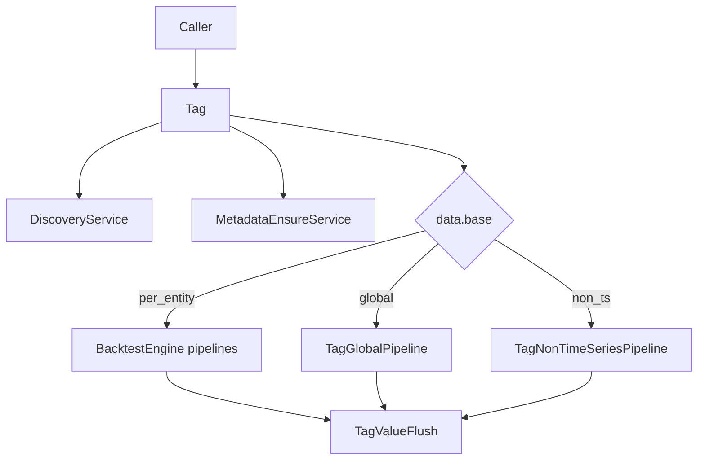

# Tag — 架构

**版本：** `0.4.0`

`modules.tag` 将 userspace 场景编排为标签计算：Discovery → settings 校验 → metadata ensure → 按 **`data.base` 路由** → flush。对外仅暴露 **`Tag`**。

---

## 职责与边界（结论）

**负责**

- 场景发现、校验与 Facade 执行入口
- per_entity（经 BacktestEngine）/ global / non_time_series（主进程推进器）
- 标签落库与计算进度水位

**不负责**

- UI catalog/run（在 BFF）
- 不另起平行于 BE 的调度框架（per_entity 硬约束见 notes）

---

## 模块结构图

```text
tag/
├── __init__.py / contracts.py / API.md
├── __test__/test_api.py
└── core/
    ├── tag.py                 # Facade
    ├── enums.py
    ├── data_class/
    ├── services/              # discovery, metadata_ensure, entity_list, progress
    └── engines/
        ├── per_entity/        # entity_based / slice_based → BE
        ├── global_based/
        ├── non_time_series/
        └── shared/            # settings / hooks / flush / calc_window
```

---

## 架构图


```mermaid
flowchart TB
  Caller --> Facade[Tag]
  Facade --> Disc[DiscoveryService]
  Facade --> Ens[MetadataEnsureService]
  Facade --> Route{data.base}
  Route -->|per_entity| BE[BacktestEngine pipelines]
  Route -->|global| G[TagGlobalPipeline]
  Route -->|non_ts| N[TagNonTimeSeriesPipeline]
  BE --> Flush[TagValueFlush]
  G --> Flush
  N --> Flush
```

---

## 执行流（摘要）

```text
Tag.execute
  → Discovery / TagSettings.validate
  → Scenario + MetadataEnsureService
  → base_route = data.base（scope × type）
  → per_entity: TagEntityListResolver → Entity/Slice Pipeline → BE → flush
  → global / non_time_series: 主进程推进器 → flush
```

硬约束见 [DESIGN.md](./DESIGN.md) 与 [notes/BOUNDARY_NOTES.md](./notes/BOUNDARY_NOTES.md)。

---

## 依赖

见 `module_info.yaml`。数据读写依赖 `data_manager`；**per_entity** 调度依赖 `backtest_engine`。

---

## 相关文档

- [API.md](../API.md)
- [glossary.yaml](../glossary.yaml)
- [DESIGN.md](./DESIGN.md)
- [BOUNDARY_NOTES.md](./notes/BOUNDARY_NOTES.md)
