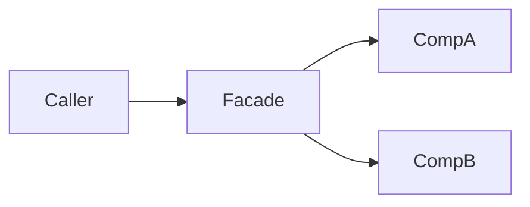

# <Module Display Name> — 架构

**版本：** `<module.version>`  
<!-- 只写已定结论；选型过程 → DESIGN（若有） -->

`<1～3 句：模块在系统中的位置、对外提供什么能力。>`

---

## 职责与边界（结论）

**负责**

- `<已确定由本模块负责的能力>`

**不负责**

- `<明确不做、由谁负责>`

---

## 模块结构图

```text
<module_root>/
├── <module_file>.py
├── contracts.py
├── API.md
├── glossary.yaml
├── module_info.yaml
├── __test__/
├── __performance__/           # 可选
├── core/
│   └── <pkg>/
└── docs/
    ├── ARCHITECTURE.md
    ├── DESIGN.md              # 可选
    ├── CONCEPTS.md            # 可选
    └── notes/
```

---

## 架构图

```text
<Caller>
   → <Facade>
        → <Component A>
        → <Component B>
```

或：



---

## 数据流（若有）

```text
<input>
  → <step 1>
  → <step 2>
  → <output / store>
```

---

## 依赖（结论）

- `<dep.name>`：`<用途>`

---

## 相关文档

- [README](../README.md)
- [API.md](../API.md)
- [术语表](../glossary.yaml)
- [设计](./DESIGN.md)<!-- 若无则删 -->
- [概念](./CONCEPTS.md)<!-- 若无则删 -->
- [快速开始](../QUICKSTART.md)<!-- 若无则删 -->
